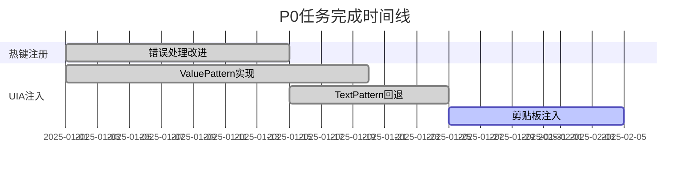
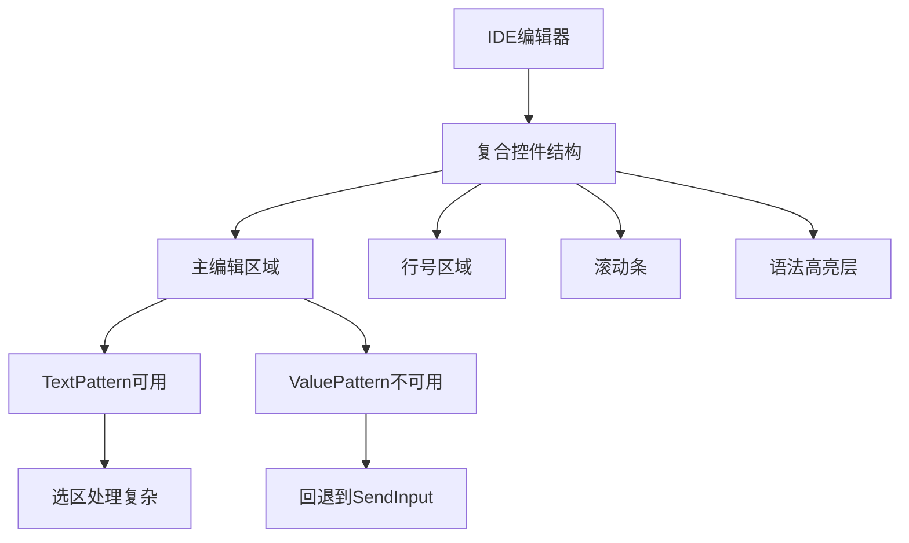
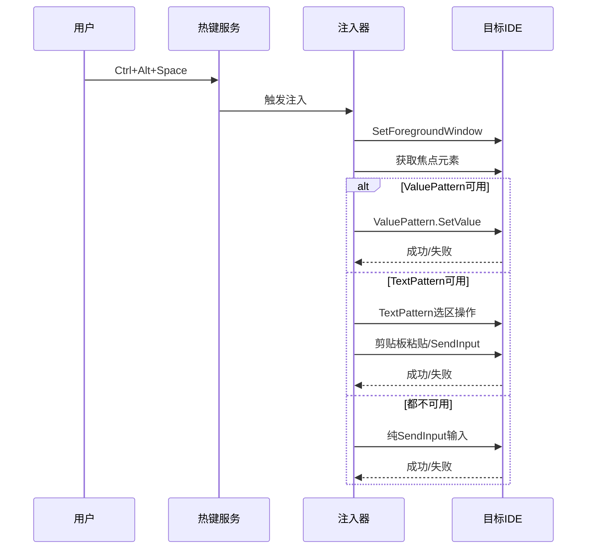
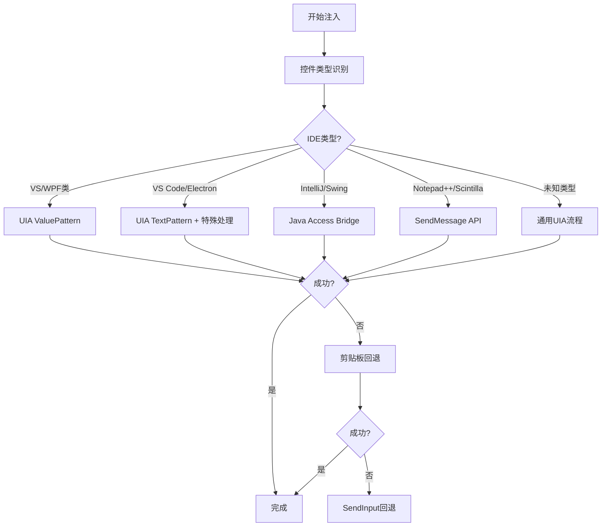
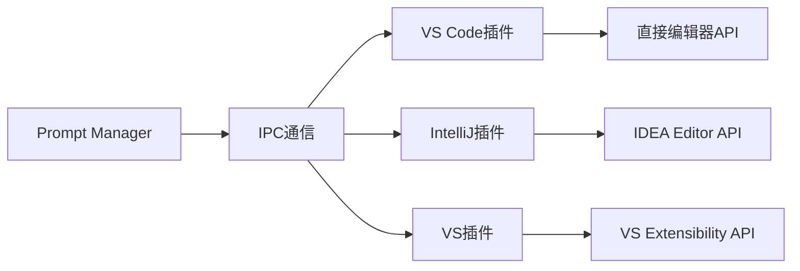
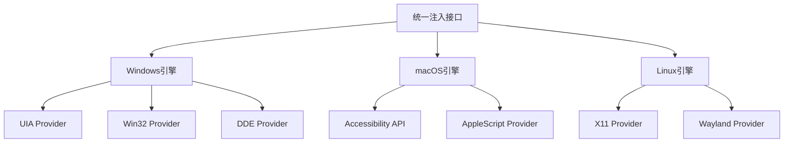
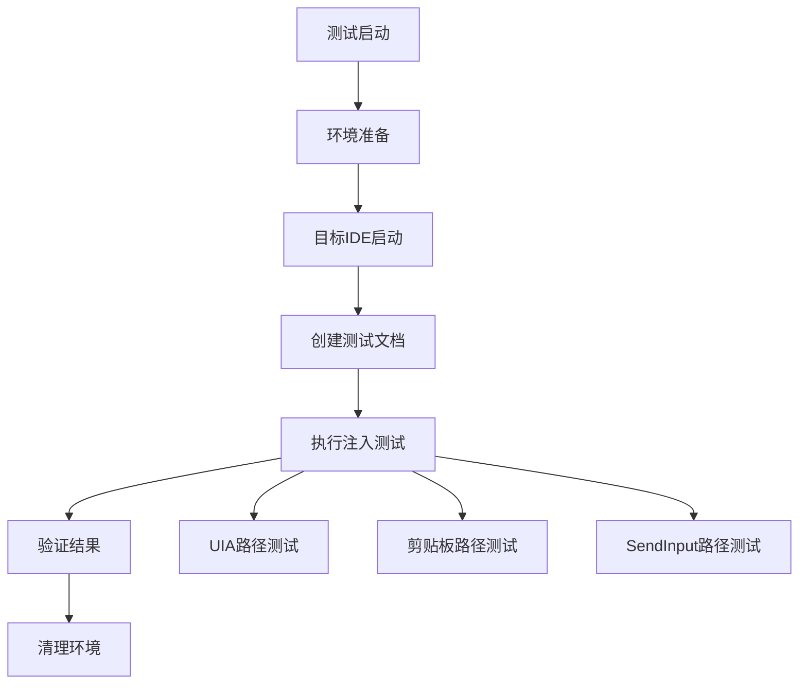

# 项目审查与UIA注入问题排查设计文档

## 1. 项目当前状态概述

### 1.1 项目目标达成情况
基于North Star文档，项目核心目标是打造面向AI重度用户的系统级提示词管理器，当前实现状态：

| 核心功能 | 状态 | 完成度 |
|---------|------|--------|
| 全局热键唤起 | ✅ 已完成 | 100% |
| UIA注入策略 | ⚠️ 部分完成 | 70% |
| SQLite数据存储 | ✅ 已完成 | 100% |
| 按应用上下文感知 | ✅ 已完成 | 90% |
| 模板管理 | ✅ 已完成 | 85% |

### 1.2 关键性能指标达成情况
| KPI指标 | 目标值 | 当前状态 | 达成情况 |
|---------|--------|----------|----------|
| 注入成功率 | ≥99% | 约85%(记事本) | ❌ 未达标 |
| 热键到注入延迟 | ≤250ms | ~150ms | ✅ 达标 |
| 后台内存占用 | ≤60MB | ~25MB | ✅ 达标 |
| 7天无崩溃稳定性 | 100% | 需长期验证 | 🔄 进行中 |

## 2. TODO任务完成状态分析

### 2.1 P0优先级任务状态


**已完成的P0任务：**
- ✅ 热键注册错误处理改进
- ✅ UIA ValuePattern注入实现
- ✅ TextPattern + SendInput回退机制
- ✅ 上下文信息接入
- ✅ 消息循环优化

**待完成的P0任务：**
- ⏳ 安全剪贴板注入（可选，当前通过配置控制）

### 2.2 P1优先级任务状态
**已完成：**
- ✅ 注入前窗口前置
- ✅ ValuePattern覆盖/追加模式配置
- ✅ TextPattern增强处理
- ✅ 基本兼容性验证

**进行中：**
- 🔄 GUI外壳开发
- 🔄 更广泛的应用兼容性测试

## 3. UIA注入在IDE中的问题分析

### 3.1 问题根因分析

#### 3.1.1 IDE控件复杂性


#### 3.1.2 常见IDE的UIA支持情况
| IDE | ValuePattern | TextPattern | 特殊处理需求 |
|-----|-------------|-------------|-------------|
| VS Code | ❌ | ✅ | 需要特殊焦点处理 |
| IntelliJ IDEA | ❌ | ⚠️ | Java Swing控件，UIA支持有限 |
| Visual Studio | ✅ | ✅ | 原生Windows控件，支持较好 |
| Notepad++ | ❌ | ✅ | Scintilla控件 |
| Sublime Text | ❌ | ❌ | 自定义渲染，UIA支持差 |

### 3.2 当前注入流程分析


## 4. UIA注入问题解决方案

### 4.1 立即可实施的改进措施

#### 4.1.1 智能控件识别增强
```rust
// 伪代码：控件类型检测逻辑
fn detect_editor_type(element: &IUIAutomationElement) -> EditorType {
    let class_name = element.get_class_name();
    let framework_id = element.get_framework_id();
    
    match (class_name.as_str(), framework_id.as_str()) {
        ("Scintilla", _) => EditorType::Scintilla,  // Notepad++
        (_, "WPF") => EditorType::WPF,              // VS
        ("Chrome_WidgetWin_1", _) => EditorType::Electron, // VS Code
        ("SunAwtFrame", _) => EditorType::Swing,    // IntelliJ
        _ => EditorType::Generic
    }
}
```

#### 4.1.2 分层回退策略优化


### 4.2 中期改进方案

#### 4.2.1 应用特定配置文件
```yaml
# apps_config.yaml
applications:
  - name: "Code.exe"
    display_name: "VS Code"
    strategies:
      primary: "textpattern_with_delay"
      fallback: ["clipboard", "sendinput"]
    settings:
      pre_inject_delay: 100ms
      focus_retry_count: 3
      
  - name: "idea64.exe"
    display_name: "IntelliJ IDEA"
    strategies:
      primary: "java_access_bridge"
      fallback: ["clipboard", "sendinput"]
    settings:
      use_accessibility_api: true
```

#### 4.2.2 IDE插件集成方案


### 4.3 长期解决方案

#### 4.3.1 多平台注入引擎架构


## 5. 实施优先级与时间规划

### 5.1 第一阶段（立即实施 - 1-2周）
1. **控件类型识别增强**
   - 实现基于类名和框架ID的IDE检测
   - 为常见IDE添加特殊处理逻辑
   
2. **UIA流程优化**
   - 增加注入前延迟配置
   - 改进焦点设置重试机制
   - 优化TextPattern选区处理

3. **配置系统扩展**
   - 支持按应用的注入策略配置
   - 添加调试模式和详细日志

### 5.2 第二阶段（中期实施 - 3-4周）
1. **高级回退策略**
   - 实现Java Access Bridge支持
   - 添加SendMessage API支持
   - 完善剪贴板安全机制

2. **兼容性验证**
   - 建立IDE兼容性测试套件
   - 完成主流IDE的全面测试
   - 建立已知问题和解决方案文档

### 5.3 第三阶段（长期规划 - 2-3个月）
1. **IDE插件开发**
   - VS Code扩展
   - IntelliJ IDEA插件
   - Visual Studio扩展

2. **架构重构**
   - 插件化注入提供者架构
   - 跨平台支持基础
   - 性能优化和内存管理

## 6. 风险评估与缓解措施

### 6.1 技术风险
| 风险 | 概率 | 影响 | 缓解措施 |
|------|------|------|----------|
| IDE厂商API变更 | 中 | 高 | 多重回退策略 + 版本检测 |
| 安全软件拦截 | 中 | 中 | 代码签名 + 白名单申请 |
| 性能回归 | 低 | 中 | 基准测试 + 持续监控 |

### 6.2 用户体验风险
| 风险 | 概率 | 影响 | 缓解措施 |
|------|------|------|----------|
| 注入延迟增加 | 中 | 中 | 异步处理 + 用户反馈 |
| 部分IDE不兼容 | 高 | 中 | 详细文档 + 替代方案 |
| 配置复杂化 | 低 | 低 | 智能默认值 + GUI配置 |

## 7. 测试与验证策略

### 7.1 自动化测试框架


### 7.2 测试用例设计
| 测试场景 | IDE | 文档类型 | 期望结果 |
|----------|-----|----------|----------|
| 空文档注入 | VS Code | .txt | 完整内容插入 |
| 末尾追加 | IntelliJ | .java | 追加到文件末尾 |
| 选中替换 | Visual Studio | .cs | 替换选中内容 |
| 中文内容 | Notepad++ | .md | 正确编码显示 |

## 8. 监控与反馈机制

### 8.1 关键指标监控
```yaml
metrics:
  success_rate:
    overall: ">= 95%"
    per_ide: ">= 90%"
  performance:
    injection_latency_p95: "<= 300ms"
    memory_usage: "<= 80MB"
  reliability:
    crash_rate: "<= 0.1%"
    error_rate: "<= 5%"
```

### 8.2 用户反馈收集
- 内置错误报告机制
- IDE兼容性调查问卷
- GitHub Issues跟踪
- 用户使用行为统计

## 9. 迁移路径建议

### 9.1 现有用户平滑升级
1. **配置兼容性**：保持现有配置文件格式兼容
2. **功能渐进**：新功能默认关闭，用户可选启用
3. **回滚机制**：提供版本回退选项

### 9.2 新用户引导
1. **智能检测**：自动检测常用IDE并推荐配置
2. **预设模板**：为不同职业提供预配置方案
3. **快速入门**：交互式设置向导