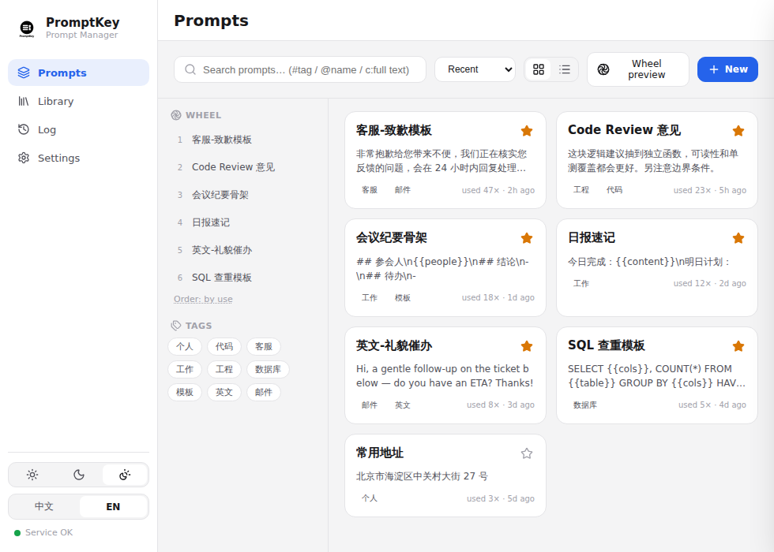
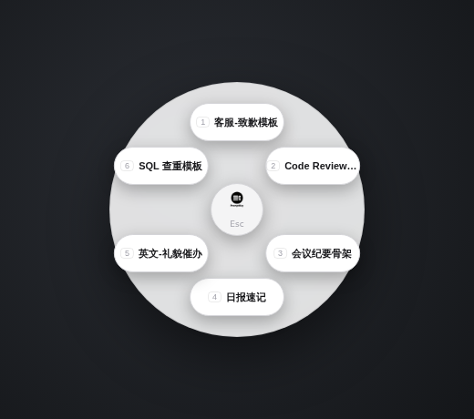
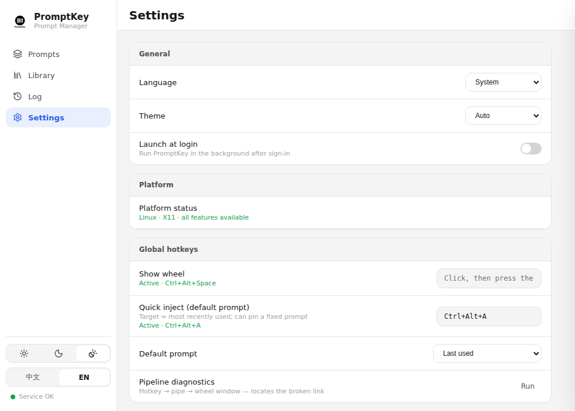

<div align="center">

# PromptKey 🎯

**面向 AI 重度用户的系统级提示词管理器**


[](https://www.rust-lang.org/)
[](https://tauri.app/)
[](https://www.microsoft.com/windows/)
[](https://www.kernel.org/)
[](https://www.apple.com/macos/)
[](LICENSE)

[](https://www.sqlite.org/)
[](https://developer.mozilla.org/docs/Web/HTML)
[](https://developer.mozilla.org/docs/Web/CSS)
[](https://developer.mozilla.org/docs/Web/JavaScript)

**[下载最新版本](https://github.com/Haaaiawd/PromptKey/releases/latest)** | **[更新日志](CHANGELOG.md)** | **[平台支持](docs/PLATFORMS.md)** | **[组件说明](docs/COMPONENTS.md)**

</div>

---

PromptKey 是一个专为 AI 重度用户设计的系统级提示词管理器：全局热键呼出**跟随光标的径向轮盘**，在任何软件中一键把高质量 Prompt 注入当前输入框。

## ✨ 功能特点

### 核心功能

- **🎡 光标轮盘** — 热键呼出跟随光标的 280px 径向轮盘（无边框透明 320px 悬浮窗），多显示器下自动避让屏幕边缘，失焦自动隐藏
- **⌨️ 按键录制式热键录入** — 设置页点击输入框后直接按下组合键即可录入（按物理键位而非字符），支持 F1–F24、方向键、小键盘、OEM 标点；非法组合（无修饰键/语法错误/系统冲突）明确拒绝并回滚
- **📌 Pin 即轮盘** — 置顶是提示词的内联属性，轮盘就是置顶集合的实时投影；排序支持自动（frecency）与手动指针拖拽两种模式
- **⚡ 默认直注** — 第二组热键跳过轮盘，直接注入「默认提示词」（固定指定 / 最近使用，可选）
- **🔍 打开即搜索** — 轮盘弹出后直接敲字过滤，不再受 6 格限制；数字键 1–9 直选
- **📚 模板库** — 内置 7 个中英精选包一键导入，支持 URL / 本地文件导入、导出分享包
- **🧩 模板变量** — `{{变量}}` 注入前表单填写；`{{clipboard}}` `{{date}}` `{{time}}` 自动填充
- **🌓 设计系统** — 明暗双主题 + 中英双语运行时切换
- **🩺 链路诊断** — 设置页一键逐环快照（引擎 / 热键 / IPC / 监听 / 轮盘窗口），轮盘唤不出时断在哪一环一眼可见

### 注入与安全

- **💉 双策略注入** — 剪贴板粘贴为主，逐键模拟兜底（Windows 为 SendInput，Linux 为 XTEST，macOS 为剪贴板+⌘V）
- **🔒 密码框门禁** — 焦点在密码/安全输入框时拒绝注入（ES_PASSWORD + UIA IsPassword 双重只读探测，Windows）
- **📋 剪贴板保护** — 注入前备份剪贴板**全部格式**，用后恢复；无法备份时自动改用逐键模拟，不污染用户数据
- **🌐 SSRF 防护** — URL 导入强制 https、逐跳校验重定向、拒绝内网/回环/云元数据地址
- **📊 真实日志** — 每次注入记录真实成败、所用策略与耗时
- **🖥️ 平台状态可见** — 设置页显示当前 OS / 会话类型 / 能力状态（Wayland 降级、macOS 权限缺失都会明确提示而非静默失败）

## 📸 截图

> 以下截图为**真实界面**在无头 Chromium 中的渲染结果（与端到端测试同机制加载 `src/` 静态资源，`__TAURI__` 桥接数据为桩）。所见即交付的前端代码，非设计原型。

**主界面 · 提示词管理**（置顶集合即轮盘内容）



**轮盘**（热键呼出时的悬浮轮盘）



**设置页**（平台状态、热键录制、链路诊断）



## 💻 平台支持

| 平台 | 状态 | 产物 | 验证情况 |
|------|------|------|----------|
| **Windows 10/11 x64** | ✅ 完整支持 | `*_x64-setup.exe`（NSIS）/ `*_x64_en-US.msi` | **已实机验收**（2.0.4 轮盘、注入、拖拽排序均经用户实测） |
| **Linux (X11)** | ⚠️ 代码就绪 | `*_amd64.deb` / `*_amd64.AppImage` | **编译通过 + 单测/E2E 通过，未做真机验证**；X11 注入/热键/上下文已实现，真机行为待确认 |
| **Linux (Wayland)** | ⚠️ 降级可用 | 同上 | 管理/剪贴板可用；X11 路径只能到达 XWayland 客户端，**原生 Wayland 窗口的自动注入未支持**，界面会明确提示降级 |
| **macOS** | ⚠️ 代码就绪 | `*_aarch64.dmg`（Apple Silicon）/ `*_x64.dmg`（Intel） | **编译路径就绪，未做真机验证**；AX 注入 + 剪贴板兜底已实现，需授予「辅助功能」权限 |

> ⚠️ **诚实声明**：Windows 是唯一经过真机验收的平台。Linux/macOS 的实现经过编译验证与单元/E2E 测试，但**从未在真机上运行过**——首次使用可能遇到我们尚未发现的问题，欢迎反馈（见文末）。CI 会验证 Linux/macOS 的编译，但不验证运行时行为。

各平台的实现细节、限制与未验证清单见 **[docs/PLATFORMS.md](docs/PLATFORMS.md)**。

## 🚀 快速开始

### Windows

1. 从 [Releases](https://github.com/Haaaiawd/PromptKey/releases/latest) 下载 `PromptKey_x.x.x_x64-setup.exe`（NSIS，中英双语安装向导）或 `.msi`
2. 需要 **WebView2 Runtime**（Windows 11 与多数 Windows 10 自带；安装包不自动安装）
3. 安装包未做代码签名，SmartScreen 提示「未知发布者」属正常，选择「仍要运行」

### Linux

```bash
# deb（推荐，自动带入 WebKitGTK 4.1 等依赖）
sudo apt install ./*_amd64.deb

# AppImage：赋予执行权限后直接运行
chmod +x *_amd64.AppImage && ./*_amd64.AppImage
```

- 需要 X11 会话（或接受 Wayland 降级行为）；运行时依赖 WebKitGTK 4.1（deb 已声明依赖；AppImage 自带）。
- AppImage 需要 FUSE2：Ubuntu 24.04+ 为 `sudo apt install libfuse2t64`（22.04 为 `libfuse2`）。
- XWayland 下大部分能力可用；纯 Wayland 会话会在设置页显示「当前会话为 Wayland，自动注入能力受限」。

### macOS

1. 按芯片选 dmg：Apple Silicon（M 系列）下 `*_aarch64.dmg`，Intel Mac 下 `*_x64.dmg`。
2. 打开 dmg，拖入 Applications。
3. **首次使用会请求「辅助功能」权限**：未授权时自动注入会降级为「复制到剪贴板 + 提示」。可在 设置 → 辅助功能权限 行重新触发系统授权对话框。
4. 未签名/未公证：首次打开可能被 Gatekeeper 拦截 —— 右键 → 打开，或 系统设置 → 隐私与安全性 →「仍要打开」。

### 使用

1. **添加提示词** —「提示词」页点击新建；勾选 ⭐ 置顶即进入轮盘
2. **呼出轮盘** — 默认 `Ctrl+Alt+Space`，轮盘出现在光标处
3. **选择注入** — 点击扇区或按数字键；含 `{{变量}}` 的模板会先弹出填写表单
4. **默认直注** — `Ctrl+Alt+A` 直接注入默认提示词（设置里可改为固定指定某条）

### 默认热键

| 热键 | 功能 |
|------|------|
| `Ctrl+Alt+Space` | 呼出轮盘 |
| `Ctrl+Alt+A` | 直接注入默认提示词 |
| `1-9` | 轮盘内选择 |
| `Esc` | 关闭轮盘 / 取消热键录制 |

> 热键在设置页以**按键录制**方式修改：点击输入框 → 按下组合键 → 提交时若组合被占用或注册失败会明确提示并回滚。修改后服务平滑重启生效。

## ⚙️ 配置

配置与数据库路径按平台约定存放（`service/src/platform/mod.rs`）：

| 平台 | 路径 |
|------|------|
| Windows | `%APPDATA%\PromptKey\config.yaml`、`%APPDATA%\PromptKey\promptmgr.db` |
| macOS | `~/Library/Application Support/PromptKey/config.yaml`、同目录 `promptmgr.db` |
| Linux | `${XDG_CONFIG_HOME:-~/.config}/promptkey/config.yaml`、同目录 `promptmgr.db` |

主要配置项：`hotkey`、`quick_hotkey`、`database_path`、`injection.order` / `allow_clipboard` / `restore_clipboard` / `secure_gate` / `debug_mode` / `max_retries`、`applications.<进程名>`（按应用注入策略）。绝大多数项可在设置页图形化修改。

进程内 IPC：Windows 用命名管道（`\\.\pipe\promptkey_selector` / `promptkey_inject`），Linux/macOS 用 Unix domain socket（位于 `$XDG_RUNTIME_DIR` 或 `$TMPDIR/promptkey-$UID/`，目录 0700、socket 0600）。

## 🛠️ 从源码构建

环境要求：

- **Rust stable ≥ 1.85**（`service/` 使用 edition 2024）
- **Node.js LTS**（仅用于安装 Tauri CLI；前端为纯 HTML/CSS/JS，无构建步骤）

```bash
git clone https://github.com/Haaaiawd/PromptKey.git
cd PromptKey
npm install -g @tauri-apps/cli   # 或 cargo install tauri-cli --version "^2"
```

**Windows**：直接 `cargo run` / `tauri build`（产出 NSIS + MSI）。

**Linux**（Debian/Ubuntu 需先装 Tauri 系统依赖）：

```bash
sudo apt install libwebkit2gtk-4.1-dev libgtk-3-dev libayatana-appindicator3-dev librsvg2-dev
cargo run      # 开发模式
tauri build    # 产出 .deb + .AppImage（target/release/bundle/）
```

**macOS**：`cargo run` / `tauri build`（产出 `.app` + `.dmg`）。公证需付费 Apple Developer 账号，`tauri.conf.json` 未配置签名。

CI/CD：PR 与 master push 运行 `cargo check`/`clippy`/`test`（Windows + Linux + macOS）+ 前端静态检查；推送 `v*` tag 触发三平台**并行**构建（Windows NSIS/MSI、Linux deb/AppImage、macOS aarch64+x64 dmg），逐产物做 magic/体积校验后追加到同一个 GitHub Release（见 `.github/workflows/release.yml` 与 `docs/PLATFORMS.md` 的打包产物表）。

### 项目结构

```
PromptKey/
├── src/                      # Tauri GUI（Rust 主进程 + 纯前端）
│   ├── main.rs               # Tauri 命令、托盘、轮盘窗口、pack 导入导出、平台状态命令
│   ├── ipc_listener.rs       # IPC 服务端：命名管道（Windows）/ UDS（Linux/macOS），service → GUI
│   ├── inject_pipe_client.rs # IPC 客户端：GUI → service 注入请求
│   ├── index.html / js/      # 主界面（提示词/模板库/记录/设置 四页）
│   ├── wheel.html / wheel.css / js/wheel.js   # 轮盘
│   ├── packs/                # 内置模板包 + manifest（7 个中英包）
│   └── icons/                # lucide + 品牌图标
├── service/                  # 内嵌引擎（workspace 成员，edition 2024）
│   └── src/
│       ├── main.rs           # 引擎主循环、模板渲染、注入调度（平台中立）
│       ├── platform/         # OS/会话探测、各平台路径、IPC 端点、状态上报
│       ├── injector/         # Injector trait + Windows / X11 / macOS-AX 实现
│       ├── context/          # Context trait + Windows / X11 / macOS 前台上下文
│       ├── hotkey/           # Hotkey trait + Windows 消息循环 / global-hotkey(unix)
│       ├── ipc/              # 命名管道 + Unix domain socket 服务端
│       ├── config/           # YAML 配置（前向兼容未知键）
│       └── db.rs             # SQLite
├── capabilities/             # Tauri IPC 权限（main + wheel-panel 两个 webview）
├── tests/e2e/                # Playwright 端到端测试（stub __TAURI__，4 套件 60+ 断言）
├── docs/                     # PLATFORMS.md / COMPONENTS.md / screenshots/
├── scripts/                  # make_icons.py（多平台图标）/ screenshots.py / check_capabilities.mjs / check_build_capabilities.mjs / verify_release_artifacts.sh
├── blueprint/                # 历史 PRD / RFC / 复杂度审计（1.x → 2.0 演进档案）
├── .loom/design/             # 现行设计文档（见下方索引）
└── .github/workflows/        # CI + Release
```

## 📐 设计文档索引

现行设计与研究文档在 `.loom/design/`（小写同名文件是别名指针）：

| 文档 | 内容 |
|------|------|
| [INJECTION_RESEARCH.md](.loom/design/INJECTION_RESEARCH.md) | 三平台注入机制调研与选型（剪贴板/逐键/AX 的依据） |
| [CROSS_PLATFORM_PLAN.md](.loom/design/CROSS_PLATFORM_PLAN.md) | 跨平台工程化计划：P1 trait 抽象 → P2 Linux-X11 → P3 macOS → P4 Wayland |
| [UI_UX_REDESIGN.md](.loom/design/UI_UX_REDESIGN.md) + [prototypes/](.loom/design/prototypes/) | 2.0 界面革新设计 + 4 个可交互原型 |
| [MERGE_ARCHITECTURE.md](.loom/design/MERGE_ARCHITECTURE.md) | 「提示词 + 轮盘」合并架构（pin 即轮盘） |
| [MARKET_DECISION.md](.loom/design/MARKET_DECISION.md) | 模板库（原市场）的产品决策 |
| [REVIEW_FINDINGS.md](.loom/design/REVIEW_FINDINGS.md) | 多轮 Devin Review 发现项与修复记录 |
| [task-brief-*.md](.loom/design/) | 各补丁版本的任务简报 |

补充文档：[docs/PLATFORMS.md](docs/PLATFORMS.md)（平台实现与验证状态）、[docs/COMPONENTS.md](docs/COMPONENTS.md)（前端模块与设计系统）、`blueprint/`（1.x 历史 PRD/RFC 档案）。

## 🧪 测试

```bash
cargo test -p service                 # Rust 单元测试（热键解析、配置、IPC 等）
python3 tests/e2e/<suite>.py          # Playwright 端到端（需 playwright + chromium）
```

`tests/e2e/` 四个套件：`hotkey_recorder`（录入交互）、`hotkey_status`（冲突/引擎故障状态与回滚）、`wheel_sort_drag`（指针拖拽排序）、`no_tauri`（无桥接环境降级）。均通过 stub `__TAURI__` 加载真实前端运行。

## 🔧 故障排查

- **热键按了没反应**：设置页 →「链路诊断」逐环定位（引擎/热键/IPC/轮盘窗口）；热键状态行直接显示 已生效/被占用/不支持/未注册。
- **轮盘唤不出**：看诊断中「监听 → wheel-show → 轮盘窗口」三环。
- **Linux 注入无效**：确认会话类型（设置页平台状态）；Wayland 会话当前降级。
- **macOS 注入失败**：设置页检查辅助功能权限，点「Grant/授权」重新触发系统对话框。
- **日志**：设置页「记录」页查看每次注入的真实成败、策略与耗时；`injection.debug_mode` 可开详细日志。

## 📋 更新日志

见 [CHANGELOG.md](CHANGELOG.md)。各版本发布说明见 [Releases](https://github.com/Haaaiawd/PromptKey/releases)。

---

<div align="center">

### 🙏 感谢使用 PromptKey

如果这个项目对你有帮助，请考虑给个 ⭐ Star！

**让 AI 提示词管理变得更简单** 💪

[报告问题](https://github.com/Haaaiawd/PromptKey/issues) · [功能建议](https://github.com/Haaaiawd/PromptKey/issues)

</div>
