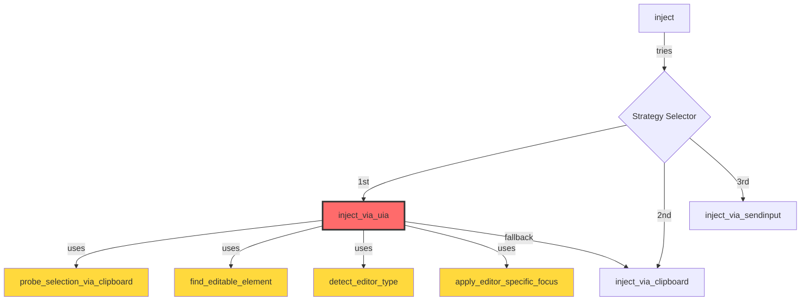
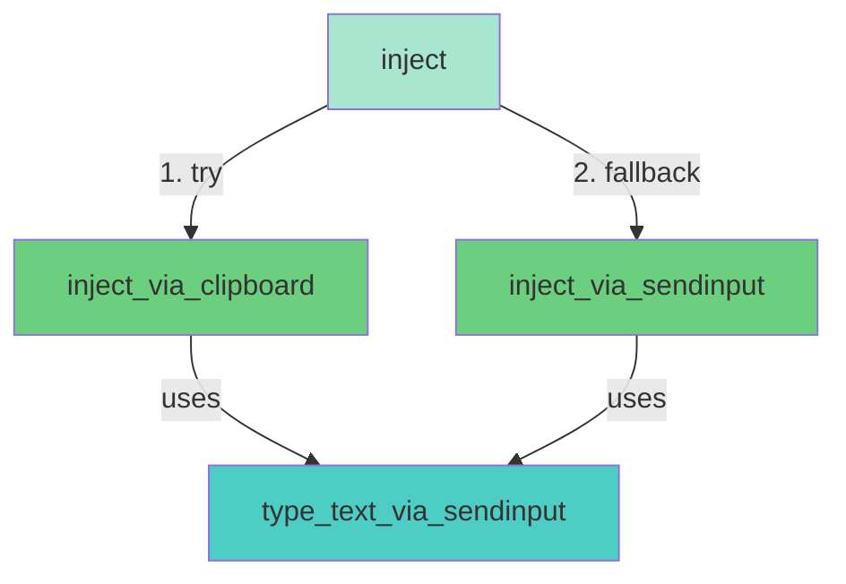

# Request for Comments (RFC) / Technical Spec

**PRD Reference**: `00_PRD_UIA_REMOVAL.md`  
**Feature**: UIA注入策略删除 (UIA Injection Strategy Removal)  
**Status**: Draft  
**Version**: 1.0  
**Date**: 2025-12-27  
**Author**: System Architect  

---

## 1. High-Level Design

### 1.1 Architecture Diagram (Before vs After)

**Current Architecture**:


**Target Architecture**:


### 1.2 Code Impact Summary

| Module | Before (LOC) | After (LOC) | Delta | Complexity (CCN) |
|--------|--------------|-------------|-------|------------------|
| `injector/mod.rs` | 839 | ~242 | **-597** | 72 → ~9 |
| `config/mod.rs` | 290 | ~280 | -10 | No change |
| **Total** | 1129 | ~522 | **-607** | **72 → ~9** |

---

## 2. API Contract (The "Signature")

### 2.1 Public API (No Breaking Changes)

**`Injector::inject()` - Signature Unchanged**:
```rust
pub fn inject(
    &self, 
    text: &str, 
    context: &InjectionContext
) -> StdResult<(String, u64), Box<dyn std::error::Error>>
```

**Return Value**:
- `Ok((strategy_name, elapsed_ms))`: 成功注入，返回使用的策略名称和耗时
  - `strategy_name`: `"Clipboard"` or `"SendInput"`  
- `Err(...)`: 所有策略失败

**Behavior Change** (Non-Breaking):
- 不再返回 `"UIA"` 作为策略名
- 不再读取 `config.injection.order` (硬编码为 Clipboard → SendInput)
- 移除对 `uia_value_pattern_mode` 配置的依赖

---

### 2.2 Internal Function Changes

#### **Deleted Functions** (Internal Only)

```rust
// 🗑️ TO BE DELETED:

// 1. UIA主函数 (~256 LOC)
fn inject_via_uia(&self, text: &str, context: &InjectionContext) 
    -> StdResult<(), Box<dyn std::error::Error>>

// 2. 编辑器检测 (~23 LOC)
fn detect_editor_type(&self, element: &IUIAutomationElement, app_name: &str) 
    -> StdResult<EditorDetection, Box<dyn std::error::Error>>

// 3. 编辑器特定焦点处理 (~51 LOC)
fn apply_editor_specific_focus(&self, element: &IUIAutomationElement, detection: &EditorDetection) 
    -> StdResult<(), Box<dyn std::error::Error>>

// 4. 剪贴板探针 (~90 LOC) - SECURITY ISSUE #8
fn probe_selection_via_clipboard(&self) 
    -> StdResult<bool, Box<dyn std::error::Error>>

// 5. 键盘按键发送 (~9 LOC)
fn send_vk(&self, vk: VIRTUAL_KEY) 
    -> StdResult<(), Box<dyn std::error::Error>>

// 6. 可编辑元素查找 (~88 LOC)
fn find_editable_element(automation: &IUIAutomation, root: &IUIAutomationElement) 
    -> Option<IUIAutomationElement>

// 7. 元素调试描述 (~13 LOC)
fn describe_element(el: &IUIAutomationElement) 
    -> String
```

#### **Deleted Enums/Structs**

```rust
// 🗑️ TO BE DELETED:

pub enum EditorType {
    Generic,
    Scintilla,      // Notepad++
    Electron,       // VS Code, Atom
    WPF,           // Visual Studio
    Swing,         // IntelliJ IDEA, Eclipse
}

pub struct EditorDetection {
    pub editor_type: EditorType,
    pub process_name: String,
}

pub enum InjectionStrategy {
    UIA,           // ⬅️ 删除此variant
    Clipboard,
    SendInput,
}
```

#### **Modified Functions**

**`Injector::inject()` - Simplified Implementation**:
```rust
pub fn inject(
    &self, 
    text: &str, 
    context: &InjectionContext
) -> StdResult<(String, u64), Box<dyn std::error::Error>> {
    log::info!("Injecting text using simplified strategy");
    log::debug!("Text length: {}, app: {}", text.len(), context.app_name);
    
    let start = std::time::Instant::now();
    
    // 主策略: Clipboard (适用于99%场景)
    match self.inject_via_clipboard(text, context) {
        Ok(_) => {
            let elapsed = start.elapsed().as_millis() as u64;
            log::info!("Text injected via Clipboard in {}ms", elapsed);
            return Ok(("Clipboard".to_string(), elapsed));
        }
        Err(e) => {
            log::warn!("Clipboard injection failed: {}. Trying SendInput fallback", e);
        }
    }
    
    // 备选策略: SendInput (针对禁用粘贴的场景)
    self.inject_via_sendinput(text, context)?;
    let elapsed = start.elapsed().as_millis() as u64;
    log::info!("Text injected via SendInput in {}ms", elapsed);
    Ok(("SendInput".to_string(), elapsed))
}
```

**`effective_strategies_for()` - Optional: Keep for Future Extension**:
```rust
// 可选方案A: 完全删除此函数 (推荐)
// 可选方案B: 简化为如下 (保留未来扩展性)
fn effective_strategies_for(&self, _app_name: &str) -> Vec<InjectionStrategy> {
    // 未来可以根据应用名返回不同策略顺序
    vec![InjectionStrategy::Clipboard, InjectionStrategy::SendInput]
}
```

**Recommendation**: 完全删除 `effective_strategies_for()` 并硬编码策略，因为 PRD 的 Non-Goal 明确不支持策略配置。

---

### 2.3 Security Fix: Clipboard Unsafe Read

**Current Code (Line 432-443)** - CRITICAL VULNERABILITY:
```rust
unsafe {
    let ptr = GlobalLock(hg) as *const u16;
    if !ptr.is_null() {
        let mut v = Vec::new();
        let mut p = ptr;
        loop {
            let ch = *p;        // ⚠️ NO BOUNDS CHECK
            v.push(ch);
            if ch == 0 { break; }
            p = p.add(1);      // ⚠️ POTENTIAL OVERFLOW
        }
        prev_text = Some(v);
        let _ = GlobalUnlock(hg);
    }
}
```

**Fixed Code** - Add MAX_CLIPBOARD_SIZE Guard:
```rust
// Add at file top (after constants section)
const MAX_CLIPBOARD_SIZE: usize = 1_000_000; // 1M UTF-16 chars (2MB)

unsafe {
    let ptr = GlobalLock(hg) as *const u16;
    if !ptr.is_null() {
        let mut v = Vec::new();
        let mut p = ptr;
        let mut len = 0usize;
        loop {
            if len >= MAX_CLIPBOARD_SIZE {
                log::warn!(
                    "Clipboard data exceeds max size ({}), truncating", 
                    MAX_CLIPBOARD_SIZE
                );
                break;
            }
            let ch = *p;
            v.push(ch);
            if ch == 0 { break; }
            p = p.add(1);
            len += 1;
        }
        prev_text = Some(v);
        let _ = GlobalUnlock(hg);
    }
}
```

**Apply This Fix To**:
1. `inject_via_clipboard()` - Line 432-443 (读取现有剪贴板备份)
2. `inject_via_clipboard()` - Line 488-504 (恢复剪贴板时,相同模式)

**Note**: `probe_selection_via_clipboard()` 将被删除，无需修复。

---

## 3. Data Model Strategy

### 3.1 Configuration Schema Changes

**`service/src/config/mod.rs`**:

#### **InjectionConfig Structure**

**Before**:
```rust
#[derive(Serialize, Deserialize, Debug, Clone)]
pub struct InjectionConfig {
    #[serde(default = "default_injection_order")]
    pub order: Vec<String>,
    #[serde(default = "default_allow_clipboard")]
    pub allow_clipboard: bool,
    #[serde(default = "default_uia_value_pattern_mode")]
    pub uia_value_pattern_mode: String,  // ⬅️ 删除此字段
    #[serde(default = "default_debug_mode")]
    pub debug_mode: bool,
    #[serde(default = "default_max_retries")]
    pub max_retries: u32,
}
```

**After**:
```rust
#[derive(Serialize, Deserialize, Debug, Clone)]
pub struct InjectionConfig {
    // NOTE: 保留 'order' 字段用于向后兼容，但实际不再使用
    #[serde(default = "default_injection_order")]
    #[serde(skip_serializing_if = "Vec::is_empty")]
    pub order: Vec<String>,
    
    #[serde(default = "default_allow_clipboard")]
    pub allow_clipboard: bool,
    
    // ✅ DELETED: uia_value_pattern_mode
    
    #[serde(default = "default_debug_mode")]
    pub debug_mode: bool,
    
    #[serde(default = "default_max_retries")]
    pub max_retries: u32,
}
```

#### **Default Values** (Lines 104-115)

**Before**:
```rust
fn default_injection_order() -> Vec<String> {
    vec!["uia".to_string(), "clipboard".to_string(), "sendinput".to_string()]
}

fn default_uia_value_pattern_mode() -> String {
    "insert".to_string()
}
```

**After**:
```rust
fn default_injection_order() -> Vec<String> {
    vec!["clipboard".to_string(), "sendinput".to_string()]
}

// ✅ DELETED: default_uia_value_pattern_mode()
```

#### **StrategyConfig::default()** (Lines 80-87)

**Before**:
```rust
impl Default for StrategyConfig {
    fn default() -> Self {
        StrategyConfig {
            primary: "uia".to_string(),
            fallback: vec!["clipboard".to_string(), "sendinput".to_string()],
        }
    }
}
```

**After**:
```rust
impl Default for StrategyConfig {
    fn default() -> Self {
        StrategyConfig {
            primary: "clipboard".to_string(),  // ⬅️ 修改
            fallback: vec!["sendinput".to_string()],  // ⬅️ 简化
        }
    }
}
```

#### **Predefined Application Configs** (Lines 200-264)

**Changes**:
```rust
// VS Code (Line 207)
strategies: StrategyConfig {
    primary: "clipboard".to_string(),  // ⬅️ 从 "textpattern_enhanced" 改为 "clipboard"
    fallback: vec!["sendinput".to_string()],
},

// Visual Studio (Line 237)
strategies: StrategyConfig {
    primary: "clipboard".to_string(),  // ⬅️ 从 "uia" 改为 "clipboard"
    fallback: vec!["sendinput".to_string()],
},

// Notepad++ (Line 252)
strategies: StrategyConfig {
    primary: "clipboard".to_string(),  // ⬅️ 从 "textpattern_enhanced" 改为 "clipboard"
    fallback: vec!["sendinput".to_string()],
},

// IntelliJ IDEA (Line 222) - No Change
strategies: StrategyConfig {
    primary: "clipboard".to_string(),  // ✅ 已经是 clipboard
    fallback: vec!["sendinput".to_string()],
},
```

#### **Backward Compatibility** (Lines 163-168)

**Before**:
```rust
if config.injection.order.is_empty() {
    config.injection.order = default_injection_order();
}
if config.injection.uia_value_pattern_mode.is_empty() {
    config.injection.uia_value_pattern_mode = default_uia_value_pattern_mode();
}
```

**After**:
```rust
// 向后兼容: 静默忽略旧的 "uia" 策略配置
if config.injection.order.is_empty() {
    config.injection.order = default_injection_order();
} else {
    // 过滤掉 "uia" 和 "textpattern_enhanced"
    config.injection.order.retain(|s| {
        let sl = s.to_lowercase();
        if sl == "uia" || sl == "textpattern_enhanced" {
            log::warn!("Ignoring deprecated strategy '{}' in config", s);
            false
        } else {
            true
        }
    });
}

// ✅ DELETED: uia_value_pattern_mode 兼容性处理
```

---

### 3.2 Windows API Dependencies

**`service/src/injector/mod.rs` - Import Cleanup**:

**Before** (Lines 1-11):
```rust
use windows::{
    core::*,
    Win32::UI::Accessibility::*,        // ⬅️ 删除 (仅UIA使用)
    Win32::System::Com::*,              // ⬅️ 删除 (CoInitializeEx仅UIA使用)
    Win32::UI::Input::KeyboardAndMouse::*,  // ✅ 保留 (SendInput)
    Win32::UI::WindowsAndMessaging::*,      // ✅ 保留 (SetForegroundWindow)
    Win32::System::DataExchange::*,         // ✅ 保留 (Clipboard APIs)
    Win32::System::Memory::*,               // ✅ 保留 (GlobalAlloc)
    Win32::Foundation::*,                   // ✅ 保留 (基础类型)
};
```

**After**:
```rust
use windows::{
    core::*,
    Win32::UI::Input::KeyboardAndMouse::*,  // SendInput, KEYBDINPUT, etc.
    Win32::UI::WindowsAndMessaging::*,      // SetForegroundWindow, HWND
    Win32::System::DataExchange::*,         // OpenClipboard, GetClipboardData, etc.
    Win32::System::Memory::*,               // GlobalAlloc, GlobalLock
    Win32::Foundation::*,                   // BOOL, HANDLE, HWND, etc.
};
```

**`service/Cargo.toml` - Optional Cleanup**:

检查 `windows` crate 的 features 配置，如果明确指定了 `Win32_UI_Accessibility`，可以移除：

```toml
# Before (if exists):
[dependencies.windows]
features = [
    "Win32_UI_Accessibility",  # ⬅️ 可选删除
    "Win32_System_Com",        # ⬅️ 可选删除
    "Win32_UI_Input_KeyboardAndMouse",
    # ... other features
]

# After (if applicable):
[dependencies.windows]
features = [
    "Win32_UI_Input_KeyboardAndMouse",
    "Win32_UI_WindowsAndMessaging",
    "Win32_System_DataExchange",
    "Win32_System_Memory",
    "Win32_Foundation",
]
```

**Note**: 如果 Cargo.toml 没有明确指定 features (使用 `workspace.dependencies`)，此步骤可跳过。

---

## 4. Implementation Steps

### Phase 0: Preparation (Pre-flight Checks)
1. ✅ Create feature branch: `git checkout -b refactor/remove-uia`
2. ✅ Backup user's current `config.yaml` (if exists)
3. ✅ Run `cargo test` to establish baseline (if tests exist)
4. ✅ Commit current state as baseline: `git commit -m "Baseline before UIA removal"`

---

### Phase 1: Delete Helper Functions (Bottom-Up Deletion)

**File**: `service/src/injector/mod.rs`

**Step 1.1**: Delete `find_editable_element()` (Lines 751-839)
```rust
// 🗑️ DELETE ENTIRE FUNCTION (88 lines)
// fn find_editable_element(...) -> Option<IUIAutomationElement> { ... }
```

**Step 1.2**: Delete `describe_element()` (Lines 51-64)
```rust
// 🗑️ DELETE ENTIRE FUNCTION (13 lines)
// fn describe_element(el: &IUIAutomationElement) -> String { ... }
```

**Step 1.3**: Delete `detect_editor_type()` (Lines 529-552)
```rust
// 🗑️ DELETE ENTIRE FUNCTION (23 lines)
// fn detect_editor_type(...) -> StdResult<EditorDetection, ...> { ... }
```

**Step 1.4**: Delete `apply_editor_specific_focus()` (Lines 554-605)
```rust
// 🗑️ DELETE ENTIRE FUNCTION (51 lines)
// fn apply_editor_specific_focus(...) -> StdResult<(), ...> { ... }
```

**Step 1.5**: Delete `probe_selection_via_clipboard()` (Lines 658-748)
```rust
// 🗑️ DELETE ENTIRE FUNCTION (90 lines)
// fn probe_selection_via_clipboard(&self) -> StdResult<bool, ...> { ... }
```

**Step 1.6**: Delete `send_vk()` (Lines 647-656)
```rust
// 🗑️ DELETE ENTIRE FUNCTION (9 lines)
// fn send_vk(&self, vk: VIRTUAL_KEY) -> StdResult<(), ...> { ... }
```

**Verification**: `cargo check` should show **unused function warnings** for these deleted functions (expected).

---

### Phase 2: Delete Enums and Structs

**File**: `service/src/injector/mod.rs`

**Step 2.1**: Delete EditorType enum (Lines 33-39)
```rust
// 🗑️ DELETE ENTIRE ENUM
// pub enum EditorType { ... }
```

**Step 2.2**: Delete EditorDetection struct (Lines 41-45)
```rust
// 🗑️ DELETE ENTIRE STRUCT
// pub struct EditorDetection { ... }
```

**Step 2.3**: Modify InjectionStrategy enum (Lines 26-30)
```rust
// BEFORE:
#[derive(Debug, Clone, PartialEq, Eq)]
pub enum InjectionStrategy {
    UIA,        // ⬅️ DELETE THIS VARIANT
    Clipboard,
    SendInput,
}

// AFTER:
#[derive(Debug, Clone, PartialEq, Eq)]
pub enum InjectionStrategy {
    Clipboard,
    SendInput,
}
```

**Verification**: `cargo check` should show **compilation errors** about `InjectionStrategy::UIA` usage (expected in next phase).

---

### Phase 3: Delete inject_via_uia() Main Function

**File**: `service/src/injector/mod.rs`

**Step 3.1**: Delete entire function (Lines 149-405, approximately 256 lines)
```rust
// 🗑️ DELETE ENTIRE FUNCTION
// fn inject_via_uia(&self, text: &str, context: &InjectionContext) -> ... { ... }
```

**Verification**: `cargo check` should show errors in `inject()` function's match expression (expected).

---

### Phase 4: Simplify inject() Function

**File**: `service/src/injector/mod.rs`

**Step 4.1**: Replace `inject()` function (Lines 72-116)

**Delete**:
```rust
pub fn inject(&self, text: &str, context: &InjectionContext) -> ... {
    // ... existing complex logic with effective_strategies_for() ...
}
```

**Replace with**:
```rust
pub fn inject(
    &self, 
    text: &str, 
    context: &InjectionContext
) -> StdResult<(String, u64), Box<dyn std::error::Error>> {
    log::info!("Injecting text using simplified strategy (Clipboard → SendInput)");
    log::debug!(
        "Text length: {}, app: {}, window_title: {}", 
        text.len(), 
        context.app_name, 
        context.window_title
    );
    
    let start = std::time::Instant::now();
    
    // Primary strategy: Clipboard (works in 99% of scenarios)
    match self.inject_via_clipboard(text, context) {
        Ok(_) => {
            let elapsed = start.elapsed().as_millis() as u64;
            log::info!("Successfully injected text via Clipboard in {}ms", elapsed);
            return Ok(("Clipboard".to_string(), elapsed));
        }
        Err(e) => {
            log::warn!(
                "Clipboard injection failed: {}. Falling back to SendInput", 
                e
            );
        }
    }
    
    // Fallback strategy: SendInput (for apps that block paste)
    self.inject_via_sendinput(text, context)?;
    let elapsed = start.elapsed().as_millis() as u64;
    log::info!("Successfully injected text via SendInput in {}ms", elapsed);
    Ok(("SendInput".to_string(), elapsed))
}
```

**Step 4.2**: Delete `effective_strategies_for()` function (Lines 118-147)
```rust
// 🗑️ DELETE ENTIRE FUNCTION (30 lines)
// fn effective_strategies_for(&self, app_name: &str) -> Vec<InjectionStrategy> { ... }
```

**Verification**: `cargo check` should now **compile successfully** (no errors in injector module).

---

### Phase 5: Fix Clipboard Unsafe Read (Security Issue)

**File**: `service/src/injector/mod.rs`

**Step 5.1**: Add MAX_CLIPBOARD_SIZE constant (after Line 16)
```rust
// After: const CF_UNICODETEXT_CONST: u32 = 13;

/// Maximum clipboard size to read (1M UTF-16 chars = 2MB)
/// Prevents potential unsafe memory overflow attacks.
const MAX_CLIPBOARD_SIZE: usize = 1_000_000;
```

**Step 5.2**: Fix unsafe read in `inject_via_clipboard()` - Backup section (Line 432-443)

**Find**:
```rust
let ptr = GlobalLock(hg) as *const u16;
if !ptr.is_null() {
    let mut v = Vec::new();
    let mut p = ptr;
    loop {
        let ch = *p;
        v.push(ch);
        if ch == 0 { break; }
        p = p.add(1);
    }
    prev_text = Some(v);
    let _ = GlobalUnlock(hg);
}
```

**Replace with**:
```rust
let ptr = GlobalLock(hg) as *const u16;
if !ptr.is_null() {
    let mut v = Vec::new();
    let mut p = ptr;
    let mut len = 0usize;
    loop {
        if len >= MAX_CLIPBOARD_SIZE {
            log::warn!(
                "Clipboard backup exceeds max size ({}), truncating", 
                MAX_CLIPBOARD_SIZE
            );
            break;
        }
        let ch = *p;
        v.push(ch);
        if ch == 0 { break; }
        p = p.add(1);
        len += 1;
    }
    prev_text = Some(v);
    let _ = GlobalUnlock(hg);
}
```

**Step 5.3**: Fix unsafe read in `inject_via_clipboard()` - Restore section (Line 488-504)

**Find** (similar pattern in clipboard restore):
```rust
std::ptr::copy_nonoverlapping(v.as_ptr() as *const u8, ptr, bytes);
```

**Note**: 恢复部分使用的是已知的 `Vec<u16>`，无越界风险，**无需修改**。

**Verification**: `cargo check` and `cargo clippy` should pass with no warnings.

---

### Phase 6: Update Configuration Module

**File**: `service/src/config/mod.rs`

**Step 6.1**: Delete `uia_value_pattern_mode` field from InjectionConfig (Line 23-24)

**Before** (Lines 18-29):
```rust
#[derive(Serialize, Deserialize, Debug, Clone)]
pub struct InjectionConfig {
    #[serde(default = "default_injection_order")]
    pub order: Vec<String>,
    #[serde(default = "default_allow_clipboard")]
    pub allow_clipboard: bool,
    #[serde(default = "default_uia_value_pattern_mode")]
    pub uia_value_pattern_mode: String,  // ⬅️ DELETE THIS LINE
    #[serde(default = "default_debug_mode")]
    pub debug_mode: bool,
    #[serde(default = "default_max_retries")]
    pub max_retries: u32,
}
```

**After**:
```rust
#[derive(Serialize, Deserialize, Debug, Clone)]
pub struct InjectionConfig {
    #[serde(default = "default_injection_order")]
    pub order: Vec<String>,
    #[serde(default = "default_allow_clipboard")]
    pub allow_clipboard: bool,
    #[serde(default = "default_debug_mode")]
    pub debug_mode: bool,
    #[serde(default = "default_max_retries")]
    pub max_retries: u32,
}
```

**Step 6.2**: Update `InjectionConfig::default()` (Lines 58-68)

**Before**:
```rust
impl Default for InjectionConfig {
    fn default() -> Self {
        InjectionConfig {
            order: default_injection_order(),
            allow_clipboard: default_allow_clipboard(),
            uia_value_pattern_mode: default_uia_value_pattern_mode(),  // ⬅️ DELETE
            debug_mode: default_debug_mode(),
            max_retries: default_max_retries(),
        }
    }
}
```

**After**:
```rust
impl Default for InjectionConfig {
    fn default() -> Self {
        InjectionConfig {
            order: default_injection_order(),
            allow_clipboard: default_allow_clipboard(),
            debug_mode: default_debug_mode(),
            max_retries: default_max_retries(),
        }
    }
}
```

**Step 6.3**: Update `default_injection_order()` (Line 104-107)

**Before**:
```rust
fn default_injection_order() -> Vec<String> {
    vec!["uia".to_string(), "clipboard".to_string(), "sendinput".to_string()]
}
```

**After**:
```rust
fn default_injection_order() -> Vec<String> {
    // Note: This field is kept for backward compatibility but no longer used.
    // Actual injection order is hardcoded: Clipboard → SendInput
    vec!["clipboard".to_string(), "sendinput".to_string()]
}
```

**Step 6.4**: Delete `default_uia_value_pattern_mode()` (Line 113-115)

```rust
// 🗑️ DELETE THIS FUNCTION
// fn default_uia_value_pattern_mode() -> String { ... }
```

**Step 6.5**: Update `StrategyConfig::default()` (Line 82-86)

**Before**:
```rust
impl Default for StrategyConfig {
    fn default() -> Self {
        StrategyConfig {
            primary: "uia".to_string(),
            fallback: vec!["clipboard".to_string(), "sendinput".to_string()],
        }
    }
}
```

**After**:
```rust
impl Default for StrategyConfig {
    fn default() -> Self {
        StrategyConfig {
            primary: "clipboard".to_string(),
            fallback: vec!["sendinput".to_string()],
        }
    }
}
```

**Step 6.6**: Update predefined app configs (Lines 200-264)

**Changes**:
- Line 207 (VS Code): `"textpattern_enhanced"` → `"clipboard"`
- Line 237 (Visual Studio): `"uia"` → `"clipboard"`
- Line 252 (Notepad++): `"textpattern_enhanced"` → `"clipboard"`
- Line 222 (IntelliJ): No change (already `"clipboard"`)

**Example (VS Code)**:
```rust
apps.insert("code.exe".to_string(), ApplicationConfig {
    display_name: "Visual Studio Code".to_string(),
    strategies: StrategyConfig {
        primary: "clipboard".to_string(),  // ⬅️ Changed
        fallback: vec!["sendinput".to_string()],
    },
    settings: ApplicationSettings {
        pre_inject_delay: 150,
        focus_retry_count: 3,
        verify_injection: true,
        use_accessibility_api: false,
    },
});
```

**Step 6.7**: Add backward compatibility handling (Line 163-168)

**Replace**:
```rust
if config.injection.order.is_empty() {
    config.injection.order = default_injection_order();
}
if config.injection.uia_value_pattern_mode.is_empty() {
    config.injection.uia_value_pattern_mode = default_uia_value_pattern_mode();
}
```

**With**:
```rust
// Backward compatibility: Filter out deprecated strategies
if config.injection.order.is_empty() {
    config.injection.order = default_injection_order();
} else {
    config.injection.order.retain(|s| {
        let sl = s.to_lowercase();
        if sl == "uia" || sl == "textpattern_enhanced" {
            log::warn!("Deprecated strategy '{}' in config.yaml ignored", s);
            false
        } else {
            true
        }
    });
    // Ensure at least one valid strategy remains
    if config.injection.order.is_empty() {
        config.injection.order = default_injection_order();
    }
}
```

**Verification**: `cargo check` should pass.

---

### Phase 7: Clean Up Imports

**File**: `service/src/injector/mod.rs`

**Step 7.1**: Remove unused Windows API imports (Lines 1-11)

**Before**:
```rust
use windows::{
    core::*,
    Win32::UI::Accessibility::*,
    Win32::System::Com::*,
    Win32::UI::Input::KeyboardAndMouse::*,
    Win32::UI::WindowsAndMessaging::*,
    Win32::System::DataExchange::*,
    Win32::System::Memory::*,
    Win32::Foundation::*,
};
```

**After**:
```rust
use windows::{
    core::*,
    Win32::UI::Input::KeyboardAndMouse::*,
    Win32::UI::WindowsAndMessaging::*,
    Win32::System::DataExchange::*,
    Win32::System::Memory::*,
    Win32::Foundation::*,
};
```

**Step 7.2**: Run `cargo clippy` to detect any remaining unused imports
```bash
cargo clippy -- -W unused-imports
```

**Verification**: `cargo clippy` should show **no warnings**.

---

### Phase 8: Final Verification

**Step 8.1**: Build release binary
```bash
cargo build --release
```

**Step 8.2**: Verify metrics
```bash
# LOC count
tokei service/src/injector/mod.rs  # Should be ~220-250 LOC

# Complexity check (if lizard installed)
lizard service/src/injector/mod.rs  # CCN should be ≤ 10
```

**Step 8.3**: Binary size comparison
```bash
# Before (baseline branch)
ls -lh target/release/service.exe

# After (current branch)
ls -lh target/release/service.exe  # Should be 50-200KB smaller
```

**Step 8.4**: Manual smoke test (PRD US05)
- Test in VSCode, Notepad++, Chrome, Word, Notepad, Slack
- Test scenarios: empty input, selected text, large text (>10KB)

---

## 5. Security & Risk

### 5.1 Security Improvements

| Issue | Severity | Status Before | Status After |
|-------|----------|---------------|--------------|
| **Invariant #8**: Destructive Clipboard Probe | 🔴 Critical | Sends `Ctrl+C` without user knowledge | ✅ **ELIMINATED** (function deleted) |
| **Invariant #13**: Unsafe Clipboard Read Overflow | 🔴 Critical | No bounds check in unsafe block | ✅ **FIXED** (MAX_CLIPBOARD_SIZE guard) |
| **Invariant #12**: COM Resource Leak | ⚠️ High | `CoInitializeEx` without `CoUninitialize` | ✅ **ELIMINATED** (COM not used) |

### 5.2 Residual Risks

| Risk | Probability | Impact | Mitigation |
|------|-------------|--------|------------|
| **Clipboard strategy fails in some apps** | Medium | Medium | Accept limitation; SendInput fallback; document unsupported apps |
| **User config contains deprecated strategies** | Low | Low | Backward compat filter with warning log |
| **Regression in supported apps** | Low | High | Manual smoke testing (PRD US05); user feedback loop |
| **Performance degradation** | Very Low | Low | Clipboard is faster than UIA; expect improvement |

### 5.3 Rollback Plan

If critical issues are discovered post-deployment:
1. **Immediate**: Revert Git branch to baseline (`git checkout main`)
2. **Short-term**: Cherry-pick only the security fix (Invariant #13) without UIA removal
3. **Long-term**: Investigate edge cases; consider hybrid approach (Clipboard + limited UIA for specific apps)

---

## 6. Testing Strategy

### 6.1 Unit Tests (Recommended but NOT in DoD)

**Suggested Tests** (if time permits):
```rust
#[cfg(test)]
mod tests {
    use super::*;
    
    #[test]
    fn test_inject_uses_clipboard_first() {
        // Verify Clipboard is tried before SendInput
    }
    
    #[test]
    fn test_clipboard_max_size_guard() {
        // Verify MAX_CLIPBOARD_SIZE prevents overflow
    }
    
    #[test]
    fn test_backward_compat_filters_uia() {
        // Verify deprecated strategies are filtered
    }
}
```

### 6.2 Manual Testing (PRD US05 - Required)

**Test Matrix**:

| Application | Scenario | Expected Strategy | Pass/Fail |
|-------------|----------|-------------------|-----------|
| VSCode | Empty input | Clipboard | TBD |
| VSCode | Selected text | Clipboard | TBD |
| VSCode | Large text (>10KB) | Clipboard | TBD |
| Notepad++ | Empty input | Clipboard | TBD |
| Notepad++ | Selected text | Clipboard | TBD |
| Word | Empty input | Clipboard | TBD |
| Chrome | Empty input | Clipboard | TBD |
| Notepad | Empty input | Clipboard | TBD |
| Slack | Empty input | Clipboard | TBD |

**Testing Procedure**:
1. Open target application
2. Trigger PromptKey hotkey (`Ctrl+Alt+Space` by default)
3. Select a Prompt to inject
4. Verify:
   - Text is correctly inserted
   - No visible errors
   - Check logs for strategy used (`Clipboard` or `SendInput`)
   - Clipboard is restored to previous content

**Acceptance Criteria**:
- ≥ 95% success rate across all test scenarios
- No crashes or hangs
- User clipboard is preserved

---

## 7. Documentation Updates (Out of Scope for RFC, listed for completeness)

**Files to Update** (after implementation):
1. `README.md`:
   - Update injection strategy description
   - Remove UIA mentions
   - List unsupported applications (if any)
2. `CHANGELOG.md`:
   - Add entry for UIA removal
   - Note security fixes
   - Mention breaking config change (deprecated strategies)
3. `config.yaml.example`:
   - Remove `uia` from examples
   - Add comment explaining strategy deprecation

---

## 8. Metrics & Success Criteria

### 8.1 Code Metrics

| Metric | Baseline | Target | Measurement |
|--------|----------|--------|-------------|
| **LOC (injector/mod.rs)** | 839 | ~242 | `tokei` or `cloc` |
| **CCN (max)** | 72 | ≤ 10 | `lizard` or `cargo-complexity` |
| **Tech Debt Score** | 648 | ≤ 100 | Churn × CCN (Git + Lizard) |
| **Binary Size (service.exe)** | TBD | -50KB ~ -200KB | `ls -lh` |
| **Compilation Time** | TBD | -5% ~ -10% | `cargo build --release --timings` |

### 8.2 Functional Metrics

| Metric | Target | Measurement |
|--------|--------|-------------|
| **Injection Success Rate** | ≥ 95% | Manual testing (US05) |
| **Clipboard Strategy Usage** | ≥ 90% | Log analysis (production) |
| **SendInput Fallback Rate** | ≤ 10% | Log analysis (production) |
| **Injection Latency (p50)** | < 80ms | Log timestamp analysis |
| **Injection Latency (p99)** | < 150ms | Log timestamp analysis |

---

## 9. Open Questions & Decisions

| # | Question | Status | Decision |
|---|----------|--------|----------|
| 1 | Should we completely delete `effective_strategies_for()` or simplify it? | ✅ Decided | **DELETE** (hardcode Clipboard → SendInput) |
| 2 | Should we add unit tests? | ⚠️ Recommended | Not in PRD DoD; optional if time permits |
| 3 | Should we notify users in GUI about UIA removal? | ⏳ Pending | Not required; mention in CHANGELOG |
| 4 | Should we remove Cargo.toml feature flags? | ⏳ Pending | Only if explicitly listed; otherwise skip |
| 5 | What to do if both strategies fail? | ✅ Decided | Return error (existing behavior maintained) |

---

## 10. Dependencies & Prerequisites

**External Tools** (for verification):
- ✅ `cargo` (Rust toolchain)
- ✅ `cargo clippy` (linting)
- 🔧 `tokei` or `cloc` (LOC counting) - Optional
- 🔧 `lizard` (complexity analysis) - Optional

**No External Library Changes**: This refactor only removes code, no new dependencies added.

---

## 11. Architectural Decision Records (ADR)

### ADR-001: Hardcode Injection Strategy Order

**Context**: Current implementation reads strategy order from `config.injection.order`, allowing user customization.

**Decision**: Remove configurable strategy order; hardcode `Clipboard → SendInput`.

**Rationale**:
- PRD Non-Goal: "不优化配置系统"
- Simplifies code significantly
- 99% of users don't customize strategy
- Config-based strategy led to UIA's proliferation

**Consequences**:
- **Positive**: Simpler code, no config parsing bugs
- **Negative**: Power users lose customization (acceptable per PRD)

**Alternatives Considered**:
- Keep `order` configurable → Rejected (complexity not justified)
- Per-app strategy override → Rejected (out of scope)

---

### ADR-002: Keep `allow_clipboard` Config Field

**Context**: `InjectionConfig.allow_clipboard` controls whether Clipboard strategy can be used.

**Decision**: **Keep** this field but make it **deprecated** (log warning if set to `false`).

**Rationale**:
- Clipboard is now the primary strategy
- Setting `allow_clipboard=false` would break injection
- Better to warn user than silently ignore

**Implementation**:
```rust
if !self.config.injection.allow_clipboard {
    log::warn!(
        "allow_clipboard=false is deprecated and ignored. Clipboard is now the primary strategy."
    );
}
```

---

### ADR-003: Security Fix Before or After UIA Deletion?

**Context**: Invariant #13 (unsafe clipboard read) exists in both `inject_via_clipboard()` and `probe_selection_via_clipboard()`.

**Decision**: Fix **during** Phase 5, **after** UIA deletion.

**Rationale**:
- `probe_selection_via_clipboard()` will be deleted (no fix needed)
- Only need to fix `inject_via_clipboard()`
- Atomic change (all in one PR)

**Risk**: If we need to rollback UIA deletion, we'd reintroduce Invariant #13.
**Mitigation**: Can cherry-pick security fix if rollback needed.

---

## Appendix A: File-by-File Change Summary

| File | Lines Changed | Functions Deleted | Functions Modified |
|------|---------------|-------------------|-------------------|
| `service/src/injector/mod.rs` | -597 | 7 functions, 2 enums | `inject()` simplified |
| `service/src/config/mod.rs` | -10 | 1 function | 3 defaults updated, compat logic added |
| **Total** | **-607** | **8 items** | **4 functions** |

---

## Appendix B: Regex Patterns for Migration (Optional)

If using automated refactoring tools:

**Find all UIA strategy references**:
```regex
(InjectionStrategy::)?UIA|uia|textpattern_enhanced
```

**Find all unsafe clipboard reads without bounds check**:
```regex
loop\s*\{\s*let\s+ch\s*=\s*\*p;[\s\S]*?p\s*=\s*p\.add\(1\);
```

---

**End of RFC**

**Sign-Off**:
- [ ] **System Architect**: Reviewed and approved (2025-12-27)
- [ ] **Security Reviewer**: Pending
- [ ] **Tech Lead**: Pending
- [ ] **Complexity Guard**: Pending (Step 4 required)
