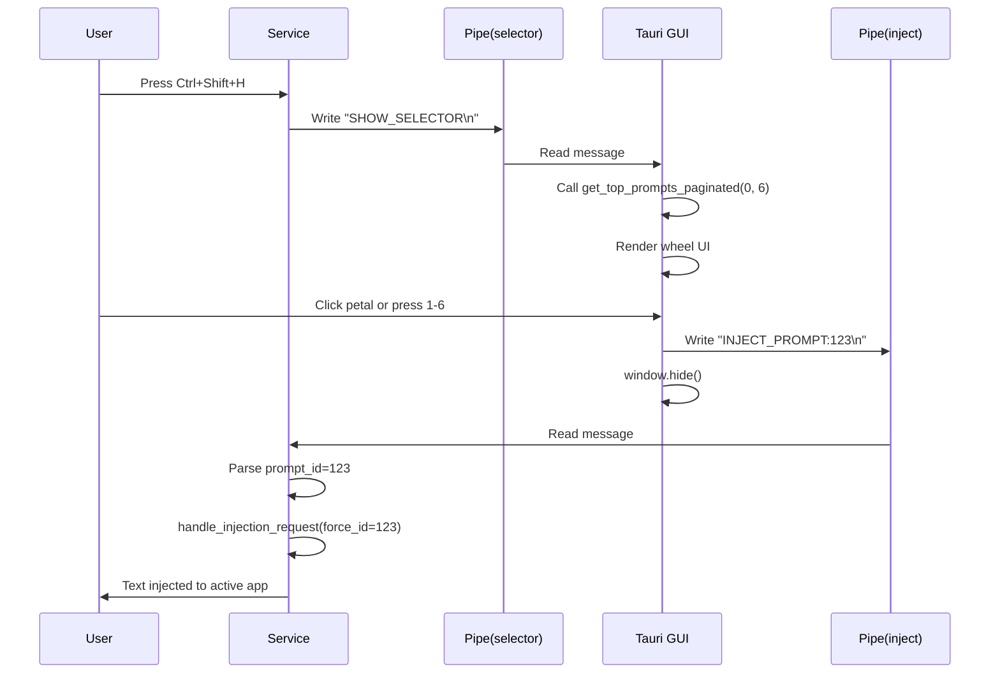

# Request for Comments (RFC) / Technical Spec

**PRD Reference**: `blueprint/02_PRD_PROMPT_WHEEL.md`  
**Feature**: PromptWheel - Radial Quick-Access Menu  
**Status**: Ready for Review  
**Version**: 1.0  
**Date**: 2025-12-29

---

## 1. High-Level Design

### Architecture Diagram



### Component Hierarchy

**Backend (Rust Service)**:
```
service/src/
├── main.rs
│   ├── inject_listener::start()         [新增] 监听注入管道
│   └── handle_injection_request()       [修改] 支持force_prompt_id
├── ipc/
│   └── inject_server.rs                 [新增] 注入命令接收器
```

**Backend (Rust GUI)**:
```
src/
└── main.rs
    ├── get_top_prompts_paginated()      [新增] 分页查询
    ├── trigger_wheel_injection()        [新增] 触发注入
    └── inject_pipe_client.rs            [新增] 注入管道客户端
```

**Frontend**:
```
src/
├── wheel.html                            [新增] 轮盘HTML
├── wheel.css                             [新增] 扇形样式
└── wheel.js                              [新增] 交互逻辑
```

---

## 2. API Contract (Signatures)

### 2.1 Tauri Commands (GUI `src/main.rs`)

#### Command: `get_top_prompts_paginated`
**Purpose**: 获取特定页的提示词（用于轮盘显示）

**签名** (已验证):
```rust
#[tauri::command]
fn get_top_prompts_paginated(
    page: u32,      // 0-indexed page number
    per_page: u32   // items per page (typically 6)
) -> Result<WheelPromptsPage, String>
```

**返回类型**:
```rust
#[derive(Serialize, Deserialize)]
struct WheelPromptsPage {
    prompts: Vec<WheelPrompt>,
    current_page: u32,
    total_pages: u32,
    total_count: u32,
}

#[derive(Serialize, Deserialize)]
struct WheelPrompt {
    id: i32,
    name: String,
    content: String,
}
```

**SQL查询** (已验证字段存在):
```sql
-- Get paginated prompts
SELECT 
    p.id,
    p.name,
    p.content
FROM prompts p
LEFT JOIN usage_logs u ON u.prompt_id = p.id
GROUP BY p.id
ORDER BY COUNT(u.id) DESC, MAX(u.created_at) DESC
LIMIT ?1 OFFSET ?2;

-- Get total count
SELECT COUNT(*) FROM prompts;
```

---

#### Command: `trigger_wheel_injection`
**Purpose**: 触发指定提示词的注入

**签名**:
```rust
#[tauri::command]
fn trigger_wheel_injection(
    prompt_id: i32
) -> Result<(), String>
```

**实现逻辑**:
1. 创建IPC客户端连接到`\\.\pipe\promptkey_inject`
2. 发送消息`INJECT_PROMPT:{prompt_id}\n`
3. 返回成功（不等待注入完成）

**依赖**:
- 新建模块`src/inject_pipe_client.rs`，类似`service/src/ipc/mod.rs`

---

### 2.2 IPC Protocol (Named Pipe)

#### Pipe 1: `\\.\pipe\promptkey_selector` (现有)
- **Direction**: Service → GUI
- **Message**: `SHOW_SELECTOR\n`
- **Server**: GUI (`src/ipc_listener.rs`)
- **Client**: Service (`service/src/ipc/mod.rs`)

#### Pipe 2: `\\.\pipe\promptkey_inject` (新增)
- **Direction**: GUI → Service
- **Message Format**: `INJECT_PROMPT:{id}\n`
  - Example: `INJECT_PROMPT:123\n`
- **Server**: Service (新增`service/src/ipc/inject_server.rs`)
- **Client**: GUI (新增`src/inject_pipe_client.rs`)

**消息解析** (Service端):
```rust
// Pseudo-code
fn parse_inject_message(msg: &str) -> Option<i32> {
    if msg.starts_with("INJECT_PROMPT:") {
        msg.strip_prefix("INJECT_PROMPT:")
           .and_then(|s| s.trim().parse::<i32>().ok())
    } else {
        None
    }
}
```

---

### 2.3 修改现有函数

#### `handle_injection_request` (在`service/src/main.rs`)

**当前签名**:
```rust
fn handle_injection_request(
    database: &db::Database,
    injector: &injector::Injector,
    context_manager: &context::ContextManager,
)
```

**新签名** (向后兼容):
```rust
fn handle_injection_request(
    database: &db::Database,
    injector: &injector::Injector,
    context_manager: &context::ContextManager,
    force_prompt_id: Option<i64>,  // 新增：如果Some，直接使用此ID
)
```

**修改逻辑**:
```rust
let prompt = if let Some(forced_id) = force_prompt_id {
    // 轮盘模式：直接使用指定ID
    prompts.iter().find(|p| p.id == Some(forced_id)).cloned()
} else {
    // 原有逻辑：查询selected_prompt_id
    database.get_selected_prompt_id()...
};
```

---

## 3. Data Model Strategy

### 3.1 Database Schema Changes

**无需修改表结构**。现有schema已满足需求：
- `prompts` table: 包含`id, name, content, tags`
- `usage_logs` table: 已有`action`字段（T1-001添加）

### 3.2 Usage Logging

注入成功后记录：
```sql
INSERT INTO usage_logs (
    prompt_id, 
    prompt_name,
    target_app,
    window_title,
    action,        -- 'wheel_select'
    query,         -- NULL (轮盘无搜索)
    strategy,      -- 'injector' (Service注入)
    success,
    injection_time_ms,
    created_at
) VALUES (...);
```

---

## 4. Frontend Implementation

### 4.1 CSS扇形布局 (`wheel.css`)

**技术选型**: CSS `clip-path` + `transform`

**核心样式**:
```css
.wheel-container {
    position: relative;
    width: 400px;
    height: 400px;
    border-radius: 50%;
    backdrop-filter: blur(10px);
    background: rgba(255, 255, 255, 0.15);
    border: 1px solid rgba(255, 255, 255, 0.3);
}

.petal {
    position: absolute;
    width: 200px;
    height: 200px;
    transform-origin: 100% 100%;
    clip-path: polygon(
        50% 50%,
        50% 0%, 
        100% 0%,
        100% 100%
    );
    /* Rotate each petal: 0deg, 60deg, 120deg, ... */
}

.petal:nth-child(1) { transform: rotate(0deg); }
.petal:nth-child(2) { transform: rotate(60deg); }
/* ... */
```

**Fallback**: 如果clip-path在某些环境下有问题，可用SVG `<polygon>`替代。

---

### 4.2 JavaScript Logic (`wheel.js`)

**核心函数签名**:
```javascript
async function init() {
    // Load page 0
    await loadPage(0);
    setupEventListeners();
}

async function loadPage(page) {
    const data = await invoke('get_top_prompts_paginated', { page, perPage: 6 });
    renderWheel(data.prompts);
    updatePagination(data.current_page, data.total_pages);
}

async function selectPrompt(promptId) {
    await invoke('trigger_wheel_injection', { promptId });
    // Window auto-hides via Tauri command
}

function setupEventListeners() {
    // Number keys 1-6
    document.addEventListener('keydown', (e) => {
        if (e.key >= '1' && e.key <= '6') {
            const index = parseInt(e.key) - 1;
            selectPromptByIndex(index);
        }
    });
    
    // Page Up/Down
    if (e.key === 'PageDown') nextPage();
    if (e.key === 'PageUp') prevPage();
    
    // ESC
    if (e.key === 'Escape') hideWindow();
}
```

---

## 5. Implementation Steps (Ordered)

### Phase 1: IPC基础设施 (P0)
1. **T-W01**: 创建`service/src/ipc/inject_server.rs`，监听`\\.\pipe\promptkey_inject`
2. **T-W02**: 在`service/src/main.rs`启动inject_listener线程
3. **T-W03**: 创建`src/inject_pipe_client.rs`，GUI端IPC客户端
4. **T-W04**: 修改`handle_injection_request`支持`force_prompt_id`参数
5. **T-W05**: 集成测试：GUI发送消息 → Service接收 → 调用注入

### Phase 2: Backend查询 (P0)
6. **T-W06**: 实现`get_top_prompts_paginated` Tauri命令
7. **T-W07**: 实现`trigger_wheel_injection` Tauri命令
8. **T-W08**: 单元测试SQL查询（验证分页逻辑）

### Phase 3: Frontend UI (P0)
9. **T-W09**: 创建`wheel.html`基础结构（6个div.petal + pagination）
10. **T-W10**: 实现`wheel.css`（扇形clip-path + glassmorphism）
11. **T-W11**: 实现`wheel.js`核心逻辑（loadPage, selectPrompt）
12. **T-W12**: 键盘事件处理（1-6数字键，PageUp/Down，ESC）

### Phase 4: 窗口配置 (P1)
13. **T-W13**: 修改`src/main.rs`窗口预创建，加载`wheel.html`
14. **T-W14**: 配置窗口透明度（`transparent: true`）
15. **T-W15**: 测试多屏环境下窗口居中

### Phase 5: 集成测试+优化 (P1)
16. **T-W16**: E2E测试全流程（热键→显示→点击→注入→隐藏）
17. **T-W17**: 性能测试（热键响应<500ms，切页<100ms）
18. **T-W18**: UI调优（扇形大小、字体截断、hover效果）

---

## 6. Security & Risk

### 6.1 Security
- **IPC Authentication**: Named Pipe本身无认证，依赖OS权限（当前用户可访问）
  - **Risk**: 同一用户的其他程序也能发送`INJECT_PROMPT`消息
  - **Mitigation**: 暂不处理（本地单用户环境，风险可接受）
- **SQL Injection**: 所有查询使用参数化（rusqlite::params!），无风险
- **XSS**: `wheel.js`使用`textContent`而非`innerHTML`，安全

### 6.2 Risk Mitigation

| Risk | Impact | Probability | Mitigation |
|------|--------|-------------|------------|
| Windows透明窗口黑色背景 | 高 (UX) | 中 | 使用`webviewInstallMode: "embedBootstrapper"` |
| Named Pipe连接失败 | 中 (功能) | 低 | Fallback: 显示toast提示用户 |
| 扇形文字溢出 | 低 (UX) | 高 | CSS `text-overflow: ellipsis` + hover tooltip |
| 翻页时数据不一致 | 低 (数据) | 低 | 每次loadPage重新查询（无状态） |

---

## 7. External Dependencies

### 7.1 Libraries (No New Dependencies)
- **Tauri**: v2.x (现有)
- **Tokio**: v1.x (现有，用于Named Pipe异步IO)
- **Rusqlite**: v0.32 (现有)
- **Windows API**: v0.52 (现有，用于SendInput)

### 7.2 External Documentation Verified
- ✅ Tauri Window API: `window.hide()` - https://v2.tauri.app/reference/javascript/api/namespacewindow/
- ✅ Tokio Named Pipe: `ServerOptions::create()` - https://docs.rs/tokio/latest/tokio/net/windows/named_pipe/
- ✅ CSS clip-path: https://developer.mozilla.org/en-US/docs/Web/CSS/clip-path

---

## 8. Open Questions & Assumptions

### Assumptions
1. 用户理解"1=12点方向，顺时针"的映射（无需UI标注序号）
2. Service进程启动早于GUI（现有架构保证）
3. 扇形hover效果足够明显，无需额外"当前选中"高亮

### Open Questions (实现时确认)
- ❓ 轮盘直径400px vs 500px？（原型测试后决定）
- ❓ 翻页控制UI位置：中心 vs 底部？（美观性vs功能性权衡）
- ❓ 空扇形处理（最后一页<6个）：隐藏 vs 置灰 vs 显示placeholder？

---

## 9. Complexity Score Self-Assessment

**Score**: 6/10

**理由**:
- ✅ **复用现有组件**: Injector, DB, IPC基础
- ✅ **无新依赖**: 所有库现成
- ⚠️ **新增IPC通道**: 中等复杂度（但模式清晰）
- ⚠️ **CSS扇形布局**: 需要调试但技术成熟
- ✅ **无状态设计**: 前后端松耦合

**预期通过Complexity Guard审查**: ✅

---

**RFC Approved by**: [待用户确认]  
**Next Step**: Complexity Guard审计
