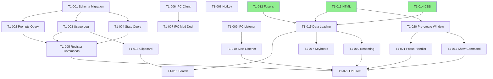

# Task Decomposition - PromptKey Blueprint

**Project**: PromptKey  
**Blueprint Phase**: ✅ Approved  
**RFC References**: 
- `00_RFC_UIA_REMOVAL.md`
- `01_RFC_QUICK_SELECTION_PANEL.md`

**Last Updated**: 2025-12-27

---

## 📋 Overview

This document decomposes the approved Blueprint into **30 atomic tasks** across **2 phases**:
- **Phase 0**: UIA Injection Strategy Removal (8 tasks, ~4h)
- **Phase 1**: Quick Selection Panel Implementation (22 tasks, ~16h)

**Total Estimated Time**: ~20 hours

---

## 📖 Legend

- **ID**: Unique task identifier (T0-XXX for Phase 0, T1-XXX for Phase 1)
- **[P]**: Parallelizable (can run independently)
- **User Story**: Maps to PRD User Stories (US-XX)
- **Done When**: Verification criterion (must be objectively testable)
- **Files**: List of files modified in this task

---

## 🎯 Phase 0: UIA Removal

**Goal**: Remove UIA injection strategy and fix security vulnerabilities  
**Total Tasks**: 8  
**Estimated Time**: 3-4 hours  
**RFC Reference**: `00_RFC_UIA_REMOVAL.md`

---

### T0-001 - Update Configuration Defaults

- **User Story**: N/A (Infrastructure)
- **Description**: Change default injection strategy from `["uia", "clipboard"]` to `["clipboard", "sendinput"]` in configuration module.
- **Dependencies**: None (can start immediately)
- **Files**:
  - `config/mod.rs`
- **Done When**:
  1. `default_injection_order()` returns `vec!["clipboard", "sendinput"]`
  2. `grep "uia" config/mod.rs` only appears in comments (not in default values)
  3. `cargo check` passes without warnings
- **Estimated LOC**: ~10

---

### T0-002 - Delete UIA Injection Function

- **User Story**: N/A (Code cleanup)
- **Description**: Remove `inject_via_uia()` function and all UIA-specific helper functions (`apply_editor_specific_focus`, `collapse_selection_via_textpattern`, etc.).
- **Dependencies**: T0-001 (config updated first)
- **Files**:
  - `service/src/injector/mod.rs`
- **Done When**:
  1. `grep "fn inject_via_uia" service/` returns no results
  2. `grep "apply_editor_specific_focus" service/` returns no results
  3. `cargo check` passes (no "unused function" warnings)
  4. CCN of `mod.rs` drops by ~40 (from ~72 to ~32)
- **Estimated LOC**: ~400 (deletion)

---

### T0-003 - Simplify Strategy Selection Logic

- **User Story**: N/A (Code cleanup)
- **Description**: Update `inject()` function to remove UIA matching case and simplify fallback logic to only handle Clipboard/SendInput.
- **Dependencies**: T0-002 (UIA function removed)
- **Files**:
  - `service/src/injector/mod.rs`
- **Done When**:
  1. `inject()` function no longer contains `InjectionStrategy::UIA` match arm
  2. `effective` variable calculation excludes UIA filtering
  3. `cargo check` passes
  4. Manual test: injection with mixed strategies succeeds
- **Estimated LOC**: ~50

---

### T0-004 - Delete Clipboard Probing Function

- **User Story**: N/A (Security fix)
- **Description**: Remove `probe_selection_via_clipboard()` function (destructive clipboard probe, Invariant #8).
- **Dependencies**: T0-002 (UIA function removed, as probe was used by UIA)
- **Files**:
  - `service/src/injector/mod.rs`
- **Done When**:
  1. `grep "probe_selection_via_clipboard" service/` returns no results
  2. `cargo check` passes
  3. No references to "Ctrl+C" clipboard backup logic remain
- **Estimated LOC**: ~60 (deletion)

---

### T0-005 - Add Clipboard Read Boundary Check

- **User Story**: N/A (Security fix)
- **Description**: Add `MAX_CLIPBOARD_SIZE` constant (4MB) and boundary check to unsafe clipboard read loop to fix out-of-bounds vulnerability (Invariant #13).
- **Dependencies**: None (independent security fix)
- **Files**:
  - `service/src/injector/mod.rs`
- **Done When**:
  1. `const MAX_CLIPBOARD_SIZE: usize = 4 * 1024 * 1024;` exists in file
  2. Unsafe read loop includes `if bytes_read > MAX_CLIPBOARD_SIZE { break; }`
  3. `cargo clippy` shows no unsafe warnings for clipboard code
  4. Manual test: clipboard read with >4MB data handles gracefully
- **Estimated LOC**: ~15

---

### T0-006 - Remove UIA Enum Variant

- **User Story**: N/A (Code cleanup)
- **Description**: Delete `InjectionStrategy::UIA` variant from enum definition.
- **Dependencies**: T0-002, T0-003 (all UIA code removed first)
- **Files**:
  - `config/mod.rs`
- **Done When**:
  1. `enum InjectionStrategy` only contains `Clipboard` and `SendInput` variants
  2. `cargo check` passes (no "unused variant" warnings)
  3. `grep "UIA" config/mod.rs` returns no results (case-insensitive)
- **Estimated LOC**: ~5 (deletion)

---

### T0-007 - Handle Legacy UIA Config

- **User Story**: N/A (Backward compatibility)
- **Description**: Update configuration parsing logic to gracefully handle old config files containing `"uia"` in injection order (map to `"clipboard"` or ignore).
- **Dependencies**: T0-006 (enum updated)
- **Files**:
  - `config/mod.rs`
- **Done When**:
  1. Loading config with `order: ["uia", "clipboard"]` does not crash
  2. "uia" is silently mapped to "clipboard" or filtered out
  3. Log message warns about deprecated "uia" strategy
  4. Manual test: old config.yaml loads successfully
- **Estimated LOC**: ~20

---

### T0-008 - Integration Testing

- **User Story**: All (validation)
- **Description**: Perform manual end-to-end testing of simplified injection flow (Clipboard → SendInput fallback).
- **Dependencies**: All previous tasks (T0-001 through T0-007)
- **Files**: None (testing task)
- **Done When**:
  1. `cargo build --release` succeeds
  2. Service starts without errors
  3. Clipboard injection works in Notepad/VSCode
  4. SendInput fallback works when clipboard is disabled
  5. No crash from unsafe clipboard read (tested with large clipboard)
  6. Log shows no warnings about missing UIA
- **Estimated LOC**: 0 (testing)

---

## 🚀 Phase 1: Quick Selection Panel

**Goal**: Implement hotkey-triggered prompt selector with fuzzy search  
**Total Tasks**: 22  
**Estimated Time**: 14-19 hours  
**RFC Reference**: `01_RFC_QUICK_SELECTION_PANEL.md`

---

### 1️⃣ Database Layer (5 tasks)

#### T1-001 - Add Schema Migration Function

- **User Story**: US11 (logging support)
- **Description**: Create `ensure_usage_logs_schema()` function to add `action` and `query` columns to `usage_logs` table if they don't exist.
- **Dependencies**: None
- **Files**:
  - `src/main.rs`
- **Done When**:
  1. Function signature: `fn ensure_usage_logs_schema(conn: &Connection) -> Result<(), String>`
  2. Uses `PRAGMA table_info(usage_logs)` to check column existence
  3. Executes `ALTER TABLE ADD COLUMN` for missing columns
  4. Called in `open_db()` after table creation
  5. Unit test with in-memory DB passes
- **Estimated LOC**: ~40

---

#### T1-002 - Implement Prompts Query Command

- **User Story**: US02, US06, US07 (search data source)
- **Description**: Create Tauri command `get_all_prompts_for_selector()` to query all prompts with usage statistics.
- **Dependencies**: T1-001 (schema migration ready)
- **Files**:
  - `src/main.rs`
- **Done When**:
  1. Function signature: `fn get_all_prompts_for_selector() -> Result<Vec<PromptForSelector>, String>`
  2. `PromptForSelector` struct includes: `id`, `name`, `content`, `category`, `tags`, `usage_count`, `last_used_at`
  3. SQL query includes `LEFT JOIN usage_logs` and `GROUP BY`
  4. `cargo check` passes
  5. Manual test via Tauri DevTools returns valid JSON
- **Estimated LOC**: ~80

---

#### T1-003 - Implement Usage Logging Command

- **User Story**: US11 (selector action logging)
- **Description**: Create Tauri command `log_selector_usage()` to insert selection events into `usage_logs`.
- **Dependencies**: T1-001 (action column exists)
- **Files**:
  - `src/main.rs`
- **Done When**:
  1. Function signature: `fn log_selector_usage(prompt_id: i32, prompt_name: String, query: Option<String>) -> Result<(), String>`
  2. Inserts row with `action='selector_select'`, `target_app='Selector Panel'`
  3. Logging is non-blocking (doesn't fail UI on DB error)
  4. `cargo check` passes
- **Estimated LOC**: ~30

---

#### T1-004 - Implement Stats Query Command

- **User Story**: US07 (usage statistics display)
- **Description**: Create Tauri command `get_selector_stats()` to retrieve Top 2 most-used prompts.
- **Dependencies**: T1-001 (action column exists)
- **Files**:
  - `src/main.rs`
- **Done When**:
  1. Function signature: `fn get_selector_stats() -> Result<SelectorStats, String>`
  2. SQL query: `SELECT name, COUNT(*) WHERE action='selector_select' GROUP BY prompt_id ORDER BY count DESC LIMIT 2`
  3. Returns empty array if no usage data
  4. `cargo check` passes
- **Estimated LOC**: ~40

---

#### T1-005 - Register Tauri Commands

- **User Story**: All selector commands
- **Description**: Add 4 new commands to `invoke_handler` macro in main.rs.
- **Dependencies**: T1-002, T1-003, T1-004 (commands implemented)
- **Files**:
  - `src/main.rs`
- **Done When**:
  1. `tauri::generate_handler![]` includes: `get_all_prompts_for_selector`, `log_selector_usage`, `get_selector_stats`, `show_selector_window`
  2. `cargo check` passes
  3. Commands visible in Tauri DevTools command list
- **Estimated LOC**: ~5

---

#### T1-005-CHK - [Verification] Verify Database Layer Implementation

- **User Story**: All Database-related stories (US02, US06, US07, US11)
- **Type**: Checkpoint (Module Milestone)
- **Description**: Validate that all database commands work correctly before proceeding to IPC layer.
- **Dependencies**: T1-001, T1-002, T1-003, T1-004, T1-005
- **Files**: None (testing)
- **Done When**:
  1. Start GUI with `cargo run`
  2. Open Tauri DevTools and invoke `get_all_prompts_for_selector` → returns valid JSON array
  3. Invoke `log_selector_usage` with test data → no errors, database file updated
  4. Invoke `get_selector_stats` → returns Top 2 prompts or empty array
  5. Check SQLite file: `action` and `query` columns exist in `usage_logs`
  6. No console errors or warnings
  7. `cargo clippy` passes with no database-related warnings
- **Estimated LOC**: 0 (verification)

---

### 2️⃣ IPC Layer (6 tasks)

#### T1-006 - Create IPC Client Module

- **User Story**: US10 (Service → GUI IPC)
- **Description**: Create `service/src/ipc/mod.rs` with `IPCClient` struct and `send_show_selector()` method using Named Pipe.
- **Dependencies**: None
- **Files**:
  - `service/src/ipc/mod.rs` (new file)
- **Done When**:
  1. File exists with `pub struct IPCClient { pipe_name: String, last_send: Mutex<Option<Instant>> }`
  2. Method signature: `pub fn send_show_selector(&self) -> Result<(), Box<dyn Error>>`
  3. Includes 500ms debounce logic
  4. Uses `OpenOptions::open("\\\\.\\pipe\\promptkey_selector")`
  5. `cargo check` (service crate) passes
- **Estimated LOC**: ~100

---

#### T1-007 - Add IPC Module Declaration

- **User Story**: US10 (Service → GUI IPC)
- **Description**: Add `mod ipc;` and `use ipc::IPCClient;` to Service's main.rs.
- **Dependencies**: T1-006 (ipc module created)
- **Files**:
  - `service/src/main.rs`
- **Done When**:
  1. `mod ipc;` appears near other module declarations
  2. `cargo check` (service crate) passes
- **Estimated LOC**: ~2

---

#### T1-008 - Register Selector Hotkey

- **User Story**: US01 (Ctrl+Shift+H trigger)
- **Description**: Extend `HotkeyService` to register second hotkey (Ctrl+Shift+H, ID=3) for selector panel.
- **Dependencies**: None (independent hotkey registration)
- **Files**:
  - `service/src/hotkey/mod.rs`
- **Done When**:
  1. `register()` or new `register_selector_hotkey()` method registers `Ctrl+Shift+H` with ID=3
  2. `wait_for_hotkey()` or new `wait_for_selector_hotkey()` checks ID=3 messages
  3. `cargo check` passes
  4. Manual test: pressing Ctrl+Shift+H triggers log message
- **Estimated LOC**: ~50

---

#### T1-009 - Create IPC Listener Module

- **User Story**: US10 (GUI receives IPC)
- **Description**: Create `src/ipc_listener.rs` with Named Pipe server loop to receive `show_selector` events.
- **Dependencies**: None (independent GUI module)
- **Files**:
  - `src/ipc_listener.rs` (new file)
- **Done When**:
  1. Function signature: `pub fn start_ipc_listener(app: AppHandle) -> JoinHandle<()>`
  2. Creates Named Pipe server: `CreateNamedPipeW("\\\\.\\pipe\\promptkey_selector", ...)`
  3. Loop: `ConnectNamedPipe()` → `ReadFile()` → parse JSON
  4. On "ShowSelector": calls `show_selector_window()`
  5. `cargo check` (GUI crate) passes
- **Estimated LOC**: ~120

---

#### T1-010 - Start IPC Listener in GUI

- **User Story**: US10 (GUI receives IPC)
- **Description**: Call `start_ipc_listener()` in GUI's `setup()` function.
- **Dependencies**: T1-009 (listener implemented)
- **Files**:
  - `src/main.rs`
- **Done When**:
  1. `mod ipc_listener;` declaration exists
  2. `setup()` calls `ipc_listener::start_ipc_listener(app.handle())`
  3. Thread handle is logged or stored
  4. `cargo check` passes
- **Estimated LOC**: ~10

---

#### T1-011 - Implement Show Window Command

- **User Story**: US01 (window visibility control)
- **Description**: Create Tauri command `show_selector_window()` to show/focus selector panel and emit reset event.
- **Dependencies**: T1-020 (window exists to show)
- **Files**:
  - `src/main.rs`
- **Done When**:
  1. Function signature: `fn show_selector_window(app: AppHandle) -> Result<(), String>`
  2. Calls `get_webview_window("selector-panel")`, `.show()`, `.set_focus()`
  3. Emits `window.emit("reset-state", ())`
  4. Returns error if window not found
  5. `cargo check` passes
- **Estimated LOC**: ~20

---

#### T1-011-CHK - [Verification] Verify IPC Communication Pipeline

- **User Story**: US01, US10 (Service↔GUI IPC)
- **Type**: Checkpoint (Module Milestone)
- **Description**: Validate that Service can trigger GUI selector panel via Named Pipe IPC.
- **Dependencies**: T1-006, T1-007, T1-008, T1-009, T1-010, T1-011
- **Files**: None (testing)
- **Done When**:
  1. Build both crates: `cargo build` (GUI), `cd service && cargo build` (Service)
  2. Start GUI first: `cargo run`
  3. Start Service in separate terminal: `cd service && cargo run`
  4. Press `Ctrl+Shift+H` in Service → GUI window appears (even if blank HTML)
  5. Check Service logs: "IPC message sent successfully"
  6. Check GUI logs: "IPC listener received: ShowSelector"
  7. No panic or crash in either process
  8. Repeat 3 times to verify debounce (500ms) works
- **Estimated LOC**: 0 (verification)

---

### 3️⃣ Frontend Assets (3 tasks)

#### T1-012 - [P] Download Fuse.js Library

- **User Story**: US02 (fuzzy search dependency)
- **Description**: Download fuse.js v7.0.0 minified file to `src/fuse.min.js`.
- **Dependencies**: None (independent resource)
- **Files**:
  - `src/fuse.min.js` (new file)
- **Done When**:
  1. File exists at `src/fuse.min.js`
  2. File size ~20KB
  3. Version comment includes "v7.0.0"
  4. `Fuse` constructor is available when loaded
- **Estimated LOC**: 0 (external resource)

---

#### T1-013 - [P] Create Selector HTML

- **User Story**: US01, US02, US06, US07 (UI structure)
- **Description**: Create `src/selector.html` with search box, results container, and stats bar.
- **Dependencies**: None (static HTML)
- **Files**:
  - `src/selector.html` (new file)
- **Done When**:
  1. File exists with `<!DOCTYPE html>` and proper structure
  2. Contains `<input id="search-box">`, `<div id="results-container">`, `<div id="stats-bar">`
  3. Loads `fuse.min.js` and `selector.js` (module type)
  4. Opens in browser without errors (static file test)
- **Estimated LOC**: ~40

---

#### T1-014 - [P] Create Selector CSS

- **User Story**: US08 (dark mode support)
- **Description**: Create `src/selector.css` with dark/light theme support using CSS variables.
- **Dependencies**: None (static CSS)
- **Files**:
  - `src/selector.css` (new file)
- **Done When**:
  1. File exists with `:root` CSS variables for colors
  2. `@media (prefers-color-scheme: dark)` overrides variables
  3. Styles for `.result-item`, `.focused`, `#search-box`, `#stats-bar`, `.tag` exist
  4. Visual test: HTML preview shows correct styling
- **Estimated LOC**: ~80

---

### 4️⃣ Frontend Logic (5 tasks)

#### T1-015 - Implement Data Loading Module

- **User Story**: US02, US07 (data initialization)
- **Description**: Create `src/selector.js` with `init()` function to load prompts, configure Fuse.js, and listen for reset events.
- **Dependencies**: T1-012 (fuse.js available), T1-002 (command exists)
- **Files**:
  - `src/selector.js` (new file)
- **Done When**:
  1. `init()` calls `invoke('get_all_prompts_for_selector')`
  2. Fuse.js config: `threshold: 0.3`, keys with weights `{name: 0.6, tags: 0.3, category: 0.1}`
  3. `listen('reset-state', resetUI)` registered
  4. Browser console shows no errors on page load
- **Estimated LOC**: ~60

---

#### T1-016 - Implement Search Logic

- **User Story**: US02 (fuzzy search + sorting)
- **Description**: Add search input event listener with Fuse.js filtering and PRD-compliant sorting (relevance → recency → id).
- **Dependencies**: T1-015 (init + Fuse.js configured)
- **Files**:
  - `src/selector.js`
- **Done When**:
  1. `searchInput.addEventListener('input', ...)` exists
  2. Empty query shows Top 10 by usage
  3. Non-empty query uses Fuse.js, sorts by: score → last_used_at → id
  4. Displays max 10 results
  5. Manual test: typing "api" filters correctly
- **Estimated LOC**: ~50

---

#### T1-017 - Implement Keyboard Navigation

- **User Story**: US03 (keyboard-only operation)
- **Description**: Add keydown event listener for ↑↓Enter ESC, with focus cycling and visual feedback.
- **Dependencies**: T1-015 (init exists)
- **Files**:
  - `src/selector.js`
- **Done When**:
  1. `document.addEventListener('keydown', ...)` handles all 4 keys
  2. ↓ and ↑ move focus with wrapping (last → first)
  3. Enter calls `selectPrompt()`
  4. ESC calls `hideWindow()`
  5. `updateFocusStyle()` applies `.focused` class
  6. Manual test: keyboard navigation works smoothly
- **Estimated LOC**: ~40

---

#### T1-018 - Implement Clipboard & Logging

- **User Story**: US04, US11 (copy to clipboard + log selection)
- **Description**: Create `selectPrompt()` function with clipboard write (+ Tauri fallback) and usage logging.
- **Dependencies**: T1-003 (log command exists)
- **Files**:
  - `src/selector.js`
- **Done When**:
  1. `selectPrompt(promptId)` tries `navigator.clipboard.writeText()`
  2. On fallback: `window.__TAURI_PLUGIN_CLIPBOARD__.writeText()`
  3. Calls `invoke('log_selector_usage', {promptId, promptName, query})`
  4. Calls `hideWindow()` on success
  5. Manual test: Enter copies content to clipboard
- **Estimated LOC**: ~30

---

#### T1-019 - Implement DOM Rendering

- **User Story**: US06 (display prompt details)
- **Description**: Create `renderResults()` and `renderStats()` functions to build result list and stats bar HTML.
- **Dependencies**: T1-015 (data loaded)
- **Files**:
  - `src/selector.js`
- **Done When**:
  1. `renderResults(prompts)` creates `.result-item` divs with name, preview (50 chars), tags
  2. `renderStats(stats)` shows Top 2 prompts with usage count
  3. Empty state: "未找到匹配的Prompts" displayed
  4. Click on item calls `selectPrompt()`
  5. Visual test: results render correctly
- **Estimated LOC**: ~80

---

#### T1-019-CHK - [Verification] Verify Frontend Selector Functionality

- **User Story**: US02, US03, US04, US06, US07 (Search, Navigation, Clipboard)
- **Type**: Checkpoint (Module Milestone)
- **Description**: Validate complete frontend logic works end-to-end in browser.
- **Dependencies**: T1-015, T1-016, T1-017, T1-018, T1-019
- **Files**: None (testing)
- **Done When**:
  1. Open `selector.html` directly in browser (file:// protocol)
  2. Check console: Fuse.js loads without errors
  3. Type "test" in search box → Fuse.js filtering activates (check console log)
  4. Mock data: Add test prompts to `selector.js` `init()` for standalone testing
  5. Press ↓ arrow → focus moves to next item (visual `.focused` class)
  6. Press Enter → console shows "selectPrompt called" + clipboard updated
  7. Press ESC → console shows "hideWindow called"
  8. Stats bar renders "Top Prompts: ..." (if stats exist)
  9. Change system theme → CSS updates correctly (dark/light mode)
  10. No JavaScript errors in console
- **Estimated LOC**: 0 (verification)

---

### 5️⃣ Window Integration (2 tasks)

#### T1-020 - Pre-create Selector Window

- **User Story**: US09 (fast wake-up)
- **Description**: Add selector window creation in `setup()` with hidden state and all required properties.
- **Dependencies**: T1-013 (selector.html exists)
- **Files**:
  - `src/main.rs`
- **Done When**:
  1. `setup()` calls `WebviewWindowBuilder::new(app, "selector-panel", "selector.html")`
  2. Window config: `inner_size(700, 500)`, `decorations(false)`, `always_on_top(true)`, `skip_taskbar(true)`, `visible(false)`
  3. Window is `.center()`
  4. `cargo check` passes
  5. App starts without errors (window hidden)
- **Estimated LOC**: ~30

---

#### T1-021 - Add Focus Event Handler

- **User Story**: US05 (auto-hide on blur)
- **Description**: Register `on_window_event` callback for selector window to hide on focus loss.
- **Dependencies**: T1-020 (window created)
- **Files**:
  - `src/main.rs`
- **Done When**:
  1. `selector_window.on_window_event(|event| ...)` registered
  2. Handler checks `WindowEvent::Focused(false)`
  3. Calls `event.window().hide()` on focus loss
  4. Manual test: clicking outside panel hides it
- **Estimated LOC**: ~10

---

### 6️⃣ Integration & Testing (1 task)

#### T1-022 - End-to-End Manual Testing

- **User Story**: All (comprehensive validation)
- **Description**: Perform complete user flow testing across all implemented features.
- **Dependencies**: All previous tasks (T1-001 through T1-021)
- **Files**: None (testing task)
- **Done When**:
  1. `cargo build --release` succeeds
  2. Service + GUI start without errors
  3. Press `Ctrl+Shift+H` → window appears <100ms
  4. Type "api" → results filter in <50ms
  5. Press ↓ → focus moves correctly
  6. Press Enter → content copied to clipboard
  7. Window auto-hides on focus loss
  8. Stats bar shows usage counts
  9. Database has `selector_select` log entries
  10. Dark mode follows system theme
- **Estimated LOC**: 0 (testing)

---

## 🔗 Dependency Graph

### Phase 0 Dependencies

```
T0-001 (Config Update)
  → T0-002 (Delete UIA)
      → T0-003 (Simplify Logic)
          → T0-006 (Remove Enum)
              → T0-007 (Handle Legacy)

T0-004 (Delete Probe) [after T0-002]

T0-005 (Boundary Check) [P] (independent security fix)

All → T0-008 (Integration Test)
```

### Phase 1 Dependencies



**Legend**:
- Green boxes: Parallelizable tasks `[P]`
- Arrows: Dependency direction (A → B means "B depends on A")

---

## 📊 Summary

| Phase | Module | Tasks | Parallel | Est. Time |
|-------|--------|-------|----------|-----------|
| **Phase 0** | UIA Removal | 8 | 1 | 3-4h |
| | - Config Updates | 2 | 0 | 30min |
| | - Code Deletion | 3 | 0 | 1.5h |
| | - Security Fixes | 1 | 1 | 30min |
| | - Testing | 2 | 0 | 1h |
| **Phase 1** | Selection Panel | 22 | 3 | 14-19h |
| | - Database Layer | 5 | 0 | 3h |
| | - IPC Layer | 6 | 1 | 4h |
| | - Frontend Assets | 3 | 3 | 2h |
| | - Frontend Logic | 5 | 0 | 4h |
| | - Window Integration | 2 | 0 | 1h |
| | - Testing | 1 | 0 | 1h |
| **TOTAL** | | **30** | **4** | **~20h** |

---

## 🎯 Execution Order Recommendation

### Critical Path (Must be sequential):

**Phase 0** (can start immediately):
1. T0-001 → T0-002 → T0-003 → T0-006 → T0-007 → T0-008
2. T0-005 can run in parallel with T0-002/003

**Phase 1** (after Phase 0 complete):

**Week 1 Sprint** (~8h):
- Day 1: T1-001, T1-002, T1-003, T1-004, T1-005 (Database Layer)
- Day 2: T1-012, T1-013, T1-014 (Frontend Assets, parallel)

**Week 2 Sprint** (~8h):
- Day 3: T1-006, T1-007, T1-008 (IPC Service)
- Day 3: T1-009, T1-010 (IPC GUI)

**Week 3 Sprint** (~8h):
- Day 4: T1-020, T1-021 (Window Integration)
- Day 4: T1-011 (Show Command)
- Day 5: T1-015, T1-016, T1-017, T1-018, T1-019 (Frontend Logic)

**Final** (~1h):
- Day 5: T1-022 (E2E Testing)

---

## ✅ Acceptance Criteria

Before marking Blueprint as complete:
- [x] All tasks have unique IDs (T0-XXX, T1-XXX)
- [x] Dependencies are explicit (→ notation + Mermaid graph)
- [x] Each task has "Done When" criterion (3-5 checks)
- [x] No task contains actual code (only descriptions)
- [x] Total estimated time is realistic (~20h)
- [ ] **User has approved this task list** ⏳ PENDING

---

## 🚫 Anti-Patterns to Avoid

❌ **Bad Task**:
```
T1-XXX - Build Selector Panel
- Implement the entire feature
- Make it fast and user-friendly
```

✅ **Good Task** (from this doc):
```
T1-002 - Implement Prompts Query Command
- Description: Create Tauri command to query all prompts with usage statistics.
- Done When: 
  1. Function signature matches RFC Section 2.1.1
  2. SQL query includes LEFT JOIN with usage_logs
  3. cargo check passes
```

---

## 📝 Notes for Implementation

1. **Parallel Opportunities**: Tasks marked `[P]` can run concurrently with others in their phase.
2. **Verification First**: Always run "Done When" checks before marking task complete.
3. **Commit Hygiene**: Each task = 1 commit message following format: `[T0-XXX] Brief description`
4. **No Code Pre-Writing**: Do NOT write code until `/build` workflow is invoked for specific task.
5. **Blocked Tasks**: If dependency is not met, DO NOT proceed. Fix dependency first.

---

## 🚀 Next Steps

**Blueprint Phase**: ✅ COMPLETE (PRD → RFC → AUDIT → TASKS all approved)

**Ready to Proceed**: 
- [ ] User approves this task breakdown
- [ ] Invoke `/build` workflow to begin implementation
- [ ] Start with Phase 0 (UIA Removal) tasks in order

---

**Document Status**: ✅ Ready for User Review  
**Last Updated**: 2025-12-27 14:44 CST  
**Total Tasks**: 30 (8 + 22)  
**Estimated Time**: ~20 hours

---

*"A well-defined task is half done."*  
— Task Master's Wisdom
