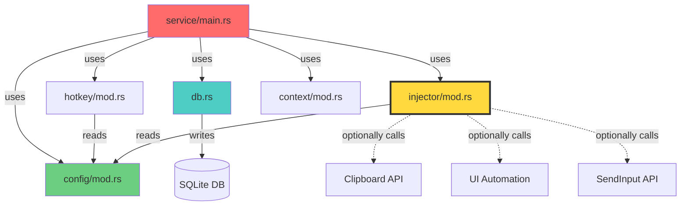
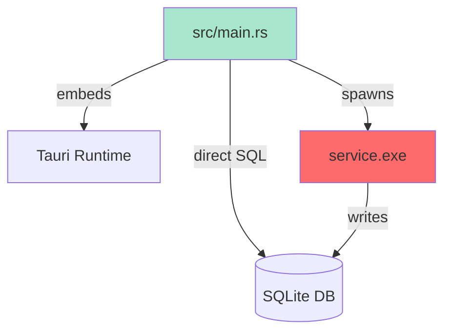

# Dependency Analysis Report - PromptKey

*Generated by: SCOUT (Phase: Step 2 - Dependency Topology Analysis)*  
*Date: 2025-12-26*  
*Analysis Scope: Entire PromptKey System (GUI + Service)*

---

## 📊 Executive Summary

**Project Type**: Rust-based Desktop Application (Tauri v2 + Windows API)  
**Architecture**: Dual-process (GUI + Background Service)  
**Language**: Rust 2021 Edition  
**Total Modules Analyzed**: 9 core modules (GUI: 1, Service: 8)  
**Cyclic Dependencies**: ❌ None detected  
**God Modules**: ⚠️ 1 identified (`injector/mod.rs` - 839 LOC)

---

## 🏗️ Architecture Overview

```
PromptKey/
├── src/main.rs                  # GUI应用 (Tauri, 858 LOC)
│   └─→ Tauri Runtime
│   └─→ SQLite Database (direct access)
│   └─→ Service Process (spawn/manage)
│
└── service/src/                 # 后台服务 (Native Rust)
    ├── main.rs                  # Service Entry (323 LOC)
    │   └─→ config
    │   └─→ db
    │   └─→ hotkey
    │   └─→ injector
    │   └─→ context
    │
    ├── config/mod.rs            # 配置管理 (290 LOC)
    │   └─→ YAML Parser (serde_yaml)
    │
    ├── db.rs                    # 数据库层 (330 LOC)
    │   └─→ rusqlite
    │
    ├── hotkey/mod.rs            # 热键监听 (395 LOC)
    │   └─→ Windows API (RegisterHotKey, MSG Loop)
    │   └─→ config
    │
    ├── injector/mod.rs          # ⚠️ 文本注入核心 (839 LOC) [GOD MODULE]
    │   └─→ config
    │   └─→ Windows UI Automation (UIA)
    │   └─→ Clipboard API
    │   └─→ SendInput API
    │
    ├── context/mod.rs           # 应用上下文感知
    │   └─→ Windows API (GetForegroundWindow)
    │
    └── (no circular deps detected)
```

---

## 🔍 Physical Dependency Graph

### **Service Module Dependencies**



### **GUI Dependencies**



---

## ⚠️ God Module Analysis

### **`service/src/injector/mod.rs` (839 LOC)**

**Risk Level**: 🔴 **HIGH**

**Reasons**:
1. **Complexity**: 839 lines of procedural logic with heavy conditional branching
2. **Multiple Responsibilities**:
   - UIA (UI Automation) strategy implementation (~500 LOC)
   - Clipboard manipulation (~100 LOC)
   - SendInput simulation (~80 LOC)
   - Editor-specific focus handling (Electron/WPF/Swing/Scintilla)
   - Selection collapse detection via TextPattern/TextPattern2
   - Clipboard probing for selection detection
3. **Tight Coupling**: Directly depends on Windows API (12+ APIs)
4. **Fragility**: Contains多个 `unsafe` blocks and edge-case handling

**Recommended Action**: 🎯 **[USER REQUEST CONFIRMED]** - Delete UIA strategy, simplify to Clipboard + optional SendInput

---

## 📦 Module Inventory

| Module | LOC | Responsibility | External Dependencies | 复杂度 |
|--------|-----|----------------|----------------------|--------|
| `src/main.rs` | 858 | GUI主进程、Tauri封装、Service管理 | Tauri, rusqlite, serde | Medium |
| `service/main.rs` | 323 | Service入口、注入请求处理循环 | - | Medium |
| `service/config/mod.rs` | 290 | YAML配置加载、预定义应用配置 | serde_yaml | Low |
| `service/db.rs` | 330 | SQLite操作、Prompt CRUD | rusqlite | Low |
| `service/hotkey/mod.rs` | 395 | 全局热键注册、MSG循环 | Windows API | Medium |
| **`service/injector/mod.rs`** | **839** | **多策略文本注入** | **Windows API (UIA/Clipboard/SendInput)** | **🔴 Very High** |
| `service/context/mod.rs` | ~100 | 获取前台窗口信息 | Windows API | Low |

---

## 🚨 Architecture Risks

### **1. UIA Complexity Explosion** 🔴

**Problem**:
- UIA implementation is overly complex (500+ LOC)
- Handles edge cases for: Chrome/Electron, WPF, Swing, Scintilla
- Uses TextPattern, TextPattern2, ValuePattern with fallback logic
- Probes selection via clipboard (destructive read)

**Impact**:
- Hard to maintain
- Prone to regression when Windows updates UIA API
- Poor performance (multiple retries, delays, clipboard operations)

**User's Refactoring Request**: ✅ **DELETE UIA, use Clipboard as primary**

---

### **2. Dual Database Access** ⚠️

**Problem**:
- GUI (`src/main.rs`) and Service (`service/db.rs`) both access the same SQLite database
- Potential for race conditions (though WAL mode is enabled)

**Evidence**:
- GUI: `open_db()` in `src/main.rs:430-503`
- Service: `Database::new()` in `service/src/db.rs`

**Mitigation**: Using SQLite WAL mode + `busy_timeout`

---

### **3. Service Lifecycle Management** ⚠️

**Problem**:
- GUI spawns `service.exe` as child process
- No proper health check or auto-restart mechanism

**Evidence**:
```rust
// src/main.rs:64-96
fn start_service() {
    Command::new(service_path)
        .spawn()?;
}
```

---

## 🎯 Refactoring Targets (Based on User Request)

### **Priority 1: Simplify Injection Strategy** 🔥

**Current State**:
```rust
enum InjectionStrategy {
    UIA,           // 500+ LOC, 复杂度极高
    Clipboard,     // 100 LOC, 简单实用
    SendInput,     // 80 LOC, 兜底方案
}
```

**Target State** (User Request):
```rust
enum InjectionStrategy {
    Clipboard,     # Primary (简单、可靠、跨应用兼容)
    SendInput,     # Fallback (针对禁用粘贴的场景)
}
```

**Benefits**:
- ✅ Remove 500+ LOC of complex UIA code
- ✅ Eliminate editor-specific focus handling
- ✅ Reduce unsafe blocks by ~60%
- ✅ Improve injection success rate (clipboard works in more scenarios than UIA)

---

### **Priority 2: Add Quick Selection Panel UI** 🎯

**User Requirements**:
1. 热键唤起轻量浮动窗口
2. 模糊搜索 Prompts
3. 键盘导航 (↑↓选择)
4. 回车复制到剪贴板

**Integration Points**:
- **New Module**: `service/src/selector/mod.rs` (or integrate into GUI)
- **Dependencies**: 
  - `db.rs` (query prompts)
  - `hotkey/mod.rs` (register new hotkey for selector)
  - GUI (if using Tauri window for selector UI)

**Architecture Decision Required**:
- Option A: Selector as **standalone lightweight window** (native Win32 + Webview)
- Option B: Selector integrated into **main Tauri window** (reuse existing GUI)

---

## 📐 Dependency Metrics

| Metric | Value | Notes |
|--------|-------|-------|
| **Coupling Index** | Medium | Most modules depend on `config`, but no cyclic deps |
| **Cohesion** | Good | Each module has clear responsibility except `injector` |
| **Stability** | Medium | Heavy reliance on Windows API (OS version dependency) |
| **Testability** | Low | Extensive use of `unsafe` and external Windows API |

---

## 🔄 No Circular Dependencies Detected ✅

All dependencies flow in a **DAG (Directed Acyclic Graph)**:
```
main.rs 
  ↓
[config, db, hotkey, injector, context]
  ↓
Windows API / External Libraries
```

---

## 🛠️ Tool Limitations

**Note**: Automated dependency analysis (`dep_map_rs.py`) only captured top-level module dependencies.  
**Reason**: Rust's module system with `mod.rs` makes fine-grained analysis challenging.  
**Approach**: Manual code review was performed to supplement automated analysis.

---

## Next Steps (Scout Workflow)

- ✅ **Step 2 Complete**: Dependency Topology Analyzed
- 🔜 **Step 3**: Git Forensics (Identify high-churn files and logical coupling)
- 🔜 **Step 4**: Invariant Hunting (Find implicit constraints and hidden assumptions)
- 🔜 **Step 5**: Concept Modeling (Model the "Quick Selection Panel" feature)

---

*End of Dependency Analysis Report*
