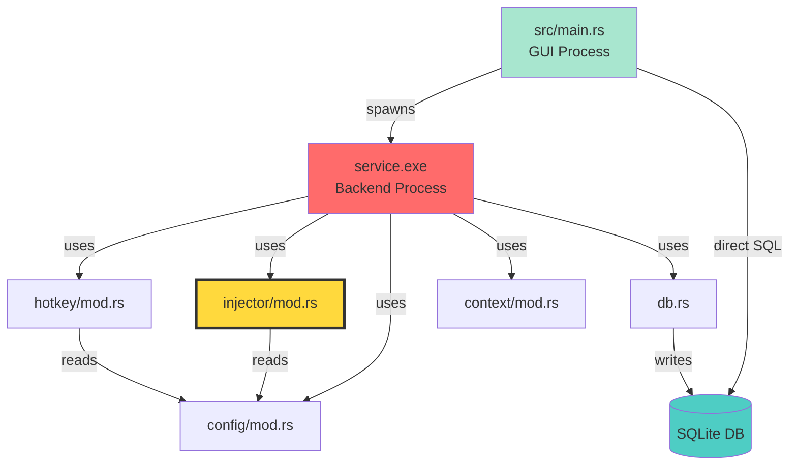

# System Context Report - PromptKey

**Generated Date**: 2025-12-27  
**Analysis Target**: PromptKey System (GUI + Service) + Quick Selection Panel Feature  
**Analyst**: SCOUT (Phase 1: Research Complete)

---

## Executive Summary

> **PromptKey** 是一个架构清晰的 Rust+Tauri 桌面应用，采用双进程设计（GUI+Service）。系统存在一个严重的技术债热点（`injector/mod.rs`，债务得分648），但整体依赖结构健康（无循环依赖）。**关键发现**：UIA注入策略复杂度极高（CCN 72）且包含2个严重安全隐患，强烈建议删除并简化为Clipboard+SendInput。**新功能方向**：快速选择面板已完成概念建模，建议先重构后开发。

**健康评分**: ⚠️ **6/10** (可维护，但需紧急重构)

---

## 1. Component Inventory

### 1.1 Existing Components

| Component | Type | Path | LOC | Description | Health |
|-----------|------|------|-----|-------------|--------|
| **Main GUI** | Tauri App | `src/main.rs` | 858 | 主窗口、Service管理、数据库访问 | ⚠️ Medium (Churn: 13) |
| **Backend Service** | Native Service | `service/src/main.rs` | 323 | 热键监听、注入请求处理循环 | ✅ Good |
| **Injector** | Core Logic | `service/src/injector/mod.rs` | 839 | 🔴 **多策略文本注入** | 🔴 **Critical** (Debt: 648) |
| **HotkeyService** | System Integration | `service/src/hotkey/mod.rs` | 395 | 全局热键注册、MSG循环 | ✅ Good |
| **Database** | Data Layer | `service/src/db.rs` | 330 | SQLite CRUD、Schema管理 | ✅ Good |
| **Config** | Configuration | `service/src/config/mod.rs` | 290 | YAML配置加载、应用级配置 | ✅ Good |
| **Context Manager** | Utility | `service/src/context/mod.rs` | ~100 | 获取前台窗口信息 | ✅ Good |
| **Frontend UI** | Web UI | `src/index.html`, `main_simple.js` | 936 | HTML/CSS/JS 前端逻辑 | ⚠️ Medium (单文件936行) |

**Total Components**: 8  
**Total LOC (analyzed)**: ~4,000

---

### 1.2 Missing Components (Dark Matter)

> [!WARNING]
> The following components are missing but critical for production readiness or planned features.

| Component | Category | Why Needed | Impact if Missing | Priority |
|-----------|----------|------------|-------------------|----------|
| **Clipboard Module** | Core Utility | 当前嵌入在injector中，难以复用 | 快速选择面板无法复用clipboard逻辑 | 🔴 P0 |
| **IPC Event Bus** | Architecture | Service和GUI间无正式通信协议 | 选择器热键无法通知GUI | 🔴 P0 |
| **Service Health Check** | Reliability | GUI无法检测Service崩溃 | 用户按热键无响应，难以排查 | ⚠️ P1 |
| **Schema Migration System** | Data Integrity | 缺少版本控制和回滚机制 | 数据库升级失败会导致应用无法启动 | ⚠️ P1 |
| **Hotkey Conflict Handler** | UX | 热键被占用时无fallback | 应用无法使用，用户不知道原因 | ⚠️ P1 |
| **Error Boundary** | Reliability | 前端无统一错误处理 | Unexpected crashes无法graceful降级 | ⚠️ P2 |
| **Structured Logging** | Observability | 日志分散在各处，无统一格式 | 生产环境问题难以追踪 | ⚠️ P2 |
| **Window Focus Manager** | UX (Selector) | 选择器窗口显示后需自动获取焦点 | 用户体验差（需要手动点击） | ⚠️ P2 |

---

## 2. Dependency Topology

### 2.1 Physical Dependencies (Dep Mapper)

**Architecture Pattern**: ✅ **Clean Layered Architecture** (No Circular Dependencies)



**Key Findings**:
- ✅ No circular dependencies detected
- ⚠️ GUI and Service both access SQLite直接（依赖WAL模式避免冲突）
- 🔴 `injector/mod.rs` is a **God Module** (839 LOC, 过度承担职责)

---

### 2.2 Logical Coupling (Git Forensics)

**Analysis Period**: 180 days | **Commits**: 28

#### **High Coupling Pairs** (Frequency > 0.7)

| File A | File B | Coupling | Count | Type | Risk |
|--------|--------|----------|-------|------|------|
| `src/index.html` | `src/styles.css` | 0.89 | 8 | Physical | ✅ Low (正常) |
| `src/main_simple.js` | `src/styles.css` | 0.67 | 6 | UI Logic | ✅ Low |

#### **Hidden Coupling** (No Physical Dependency)

| File A | File B | Coupling | Indicator | Recommendation |
|--------|--------|----------|-----------|----------------|
| `service/src/main.rs` | `src/main.rs` | 0.54 | ⚠️ **跨进程耦合** | 定义稳定的IPC Contract |

**Root Cause**: 两个独立进程频繁一起修改，说明接口协议不稳定或共享数据结构变更频繁。

---

## 3. Risks & Warnings

### 3.1 Circular Dependencies
> ✅ **None Detected**

All dependencies form a clean DAG (Directed Acyclic Graph).

---

### 3.2 God Modules

> [!CAUTION]
> **Critical Technical Debt Identified**

| Module | LOC | Churn | Max CCN | Debt Score | Status |
|--------|-----|-------|---------|------------|--------|
| **`service/src/injector/mod.rs`** | 839 | 9 | **72** | **648** | 🔴 **DISASTER ZONE** |

**Analysis**:
- **循环复杂度 72**: 远超健康阈值（推荐 <15）
- **技术债得分 648**: 是第二名的 **2.1倍**
- **修改频率 9次**: 高复杂度 + 频繁修改 = Bug孵化器

**Composition**:
- UIA Strategy: ~500 LOC (60%)
- Clipboard Strategy: ~100 LOC (12%)
- SendInput Strategy: ~80 LOC (10%)
- Editor Detection: ~80 LOC (9%)
- Utility Functions: ~79 LOC (9%)

**Recommendation**: 🎯 **[用户已确认]** 删除UIA策略，简化为Clipboard+SendInput

---

### 3.3 Tech Debt Hotspots

**Top 5 by Debt Score**:

| Rank | File | Churn | CCN | Debt | Action |
|------|------|-------|-----|------|--------|
| 1 | `service/src/injector/mod.rs` | 9 | 72 | 648 | 🔴 **Refactor NOW** |
| 2 | `src/main.rs` (GUI) | 13 | 24 | 312 | ⚠️ Monitor |
| 3 | `src/main_simple.js` | 8 | 21 | 168 | ⚠️ Consider modularize |
| 4 | `service/src/db.rs` | 5 | 17 | 85 | ✅ Acceptable |
| 5 | `service/src/main.rs` | 7 | 12 | 84 | ✅ Good |

---

## 4. Implicit Constraints (Invariant Hunter)

**Total Invariants Found**: 23  
**Critical Issues**: 🔴 2  
**High Risk**: ⚠️ 6  
**Medium Risk**: ⚠️ 15

### 4.1 Critical Security Issues 🔴

#### **Invariant #8: 破坏性剪贴板探测**
- **Location**: `service/src/injector/mod.rs:272-278, 658-748`
- **Issue**: 为检测选区，发送 `Ctrl+C` 复制操作（用户不知情）
- **Risks**: 
  - 触发应用副作用（如IDE复制整行）
  - 剪贴板竞态（30ms窗口）
  - 用户数据丢失
- **Mitigation**: ✅ **将随UIA删除**

#### **Invariant #13: unsafe 越界风险**
- **Location**: `service/src/injector/mod.rs:432-443`
- **Issue**: 读取剪贴板UTF-16数据时，假设一定以NULL结尾，无边界检查
- **Risks**: 内存越界读取（如果数据被污染）
- **Mitigation**: 添加 `MAX_CLIPBOARD_SIZE` 限制或随UIA删除

---

### 4.2 High-Risk Assumptions ⚠️

| # | Invariant | Issue | Impact |
|---|-----------|-------|--------|
| 1 | 剪贴板恢复竞态 | ~180ms暴露窗口，用户可能操作剪贴板 | 覆盖用户新复制的内容 |
| 5 | 焦点稳定性 | 获取焦点后300+行代码，焦点可能失效 | 注入到错误窗口 |
| 12 | COM资源未释放 | `CoInitializeEx` 无对应 `CoUninitialize` | 潜在内存泄漏 |
| 14 | 固定延时不适应 | 硬编码60-150ms延时 | 慢系统失败，快系统浪费时间 |
| 15 | SetForegroundWindow无检查 | 忽略返回值 | 注入失败但继续执行 |
| 20 | Service无健康检查 | GUI不监控Service状态 | 崩溃后用户无感知 |

---

### 4.3 Business Invariants

> ✅ **None Identified** (本项目主要是工具型应用，无复杂业务规则)

---

### 4.4 Hardcoded Values

| Type | Location | Value | Risk |
|------|----------|-------|------|
| Delay | `injector/mod.rs` | 60-150ms | ⚠️ 不适应不同系统性能 |
| Retry | `injector/mod.rs:414` | 5次×10ms | ⚠️ 可能不够 |
| HotkeyID | `hotkey/mod.rs` | 固定ID | ⚠️ 可能冲突 |

---

## 5. Conceptual Model - Quick Selection Panel

### 5.1 Feature Overview

**Confirmed Requirements** (用户决策):
- ✅ 热键: `Ctrl+Shift+H`
- ✅ 实现方案: Tauri多窗口（在GUI进程）
- ✅ 窗口行为: 失焦自动关闭
- ✅ 创建时机: **应用启动时预创建**（隐藏状态）
- ✅ 搜索引擎: fuse.js（模糊搜索）
- ✅ UI元素: 内容预览 + 分类标签 + **统计信息**
- ✅ 窗口大小: 700×500px
- ✅ MVP范围: Phase 1.5（含搜索+鼠标点击）
- ✅ 统计功能: 记录并**显示在面板底部**（"最常用"、"最近使用"）
- ✅ IPC方案: Named Pipe (`\\.\pipe\promptkey_selector`)

---

### 5.2 Ubiquitous Language

| Term | Definition | Exists? |
|------|------------|---------|
| **Prompt** | 提示词实体（id, name, content, tags, category） | ✅ Yes |
| **SelectionPanel** | 快速选择面板主组件 | ❌ New |
| **SearchEngine** | 模糊搜索引擎（fuse.js） | ❌ New |
| **FocusedItem** | 当前选中的Prompt | ❌ New |
| **SelectorHotkey** | 触发选择器的热键（`Ctrl+Shift+H`） | ❌ New |
| **UsageStats** | 使用统计数据（Top 3 + Last Used） | ❌ New |

---

### 5.3 Data Flows

```
[User] --presses Ctrl+Shift+H-->
    [HotkeyService] --sends via Named Pipe-->
        [GUI EventListener] --shows window-->
            [SelectionPanel] 
                │
                ├--fetch--> [Database.getAllPrompts()] 
                │              └--> returns Vec<Prompt>
                │
                ├--fetch--> [Database.getUsageStats()]
                │              └--> returns {mostUsed, lastUsed}
                │
                ├--render--> [PromptList + StatsPanel]
                │
                ├--user types "api"-->
                │   [SearchEngine.filter("api")]
                │       └--> Fuzzy match on name+tags+category
                │       └--> Return top 10 results
                │
                ├--user navigates ↑↓-->
                │   [Update FocusedIndex]
                │
                └--user presses Enter-->
                    [copy_prompt_to_clipboard(content)]
                    [log_selector_usage(prompt.id)]
                    [panel.hide()]
```

---

### 5.4 UI Layout (700×500px)

```
┌───────────────────────────────────────────┐ ─┐
│  🔍 [Search input field]                  │  │ 60px
├───────────────────────────────────────────┤  │
│  📝 Prompt Name 1          [Category]     │  │
│     Preview: First 50 chars of content... │  │ 60px/item
│  📝 Prompt Name 2          [Category]     │  │
│     Preview: ...                          │  │ × 7 items
│  ... (7 items visible, scroll for more)   │  │ = 420px
├───────────────────────────────────────────┤  │
│  📊 🔥 Hot: API Call(23) | REST(18)       │  │ 20px
└───────────────────────────────────────────┘ ─┘
Total: 500px
```

---

### 5.5 Technical Contracts

**New Tauri Commands**:
```rust
#[tauri::command]
fn get_all_prompts_for_selector() -> Result<Vec<Prompt>, String>;

#[tauri::command]
fn copy_prompt_to_clipboard(content: String) -> Result<(), String>;

#[tauri::command]
fn log_selector_usage(prompt_id: i32) -> Result<(), String>;

#[tauri::command]
fn get_usage_stats() -> Result<UsageStats, String>;
```

**UsageStats Structure**:
```rust
#[derive(Serialize, Deserialize)]
struct UsageStats {
    most_used: Vec<(String, i32)>,  // [(prompt_name, count)]
    last_used: Option<(String, String)>,  // (prompt_name, timestamp)
}
```

---

## 6. Refactoring Plan (User Confirmed)

### **Phase 0: UIA Removal** 🔴 **[PRIORITY]**

**Rationale**: 用户确认**先删除UIA，再实现选择面板**

**Scope**:
- 🗑️ Remove `inject_via_uia()` function (~500 LOC)
- 🗑️ Remove editor detection logic (~80 LOC)
- 🗑️ Remove UIA-related unsafe blocks (~60 blocks)
- 🗑️ Remove `probe_selection_via_clipboard()` (破坏性探测)
- ✅ Keep `inject_via_clipboard()` and `inject_via_sendinput()`
- ✅ Simplify `inject()` function to use only 2 strategies

**Expected Outcome**:
- 📉 Reduce `injector/mod.rs` from 839 → ~300 LOC
- 📉 Reduce CCN from 72 → ~10
- 📉 Reduce Debt Score from 648 → ~100
- 🛡️ Eliminate 14/23 implicit constraints
- ✅ Clean codebase for new feature development

**Estimated Effort**: 4-6 hours

---

### **Phase 1: Quick Selection Panel (MVP)**

**Scope**: See Concept Model Section 5.x

**Key Tasks**:
1. Extract clipboard logic to standalone module
2. Implement Named Pipe IPC
3. Extend HotkeyService to support `Ctrl+Shift+H`
4. Create Tauri window for SelectionPanel
5. Implement frontend (HTML/CSS/JS + fuse.js)
6. Add usage logging
7. Implement stats display

**Estimated Effort**: 2-3 days

---

## 7. Architecture Decisions

| Decision | Choice | Rationale |
|----------|--------|-----------|
| **Selector Window** | ✅ Tauri Multi-Window | 开发效率高，易于美化，复用现有框架 |
| **Search Algorithm** | ✅ fuse.js | 功能强大，性能好，支持高亮 |
| **IPC Mechanism** | ✅ Named Pipe | Windows原生，安全，性能优秀 |
| **Window Creation** | ✅ Pre-create (on app start) | 响应速度快（<30ms），用户体验好 |
| **Stats Display** | ✅ Bottom Panel (Hot + Last) | 增加面板价值，引导用户使用高频Prompt |
| **Refactor Order** | ✅ **UIA Removal First** | 干净的代码库更易于开发新功能 |

---

## 8. Human Checkpoints

> [!IMPORTANT]
> Please confirm the following before proceeding to Blueprint Phase:

### **Research Phase Sign-Off**

- [ ] **Component Inventory完整吗？** 
  - 8个现有组件 + 8个缺失组件（已识别）
  
- [ ] **风险评估准确吗？**
  - injector/mod.rs 作为最高风险点（Debt: 648）
  - 2个Critical安全问题
  - 6个High-Risk假设
  
- [ ] **隐性约束已全部记录吗？**
  - 23个Invariants已识别并分类
  - 所有关键假设已标注代码位置
  
- [ ] **概念模型清晰吗？**
  - 快速选择面板的实体、数据流、状态机已定义
  - UI布局和技术契约已明确
  
- [ ] **重构计划可接受吗？**
  - Phase 0: 先删除UIA（4-6小时）
  - Phase 1: 再实现选择面板（2-3天）

---

## 9. Recommendations for Next Phase

### **Immediate Actions** (Blueprint Phase)

1. **📋 Spec Writer**: 为"UIA删除"编写详细的重构规格
   - 定义剪贴板模块接口
   - 明确新的注入策略流程
   - 列出需要更新的测试用例

2. **🏗️ System Architect**: 设计选择面板的技术架构
   - Tauri窗口配置（JSON）
   - Named Pipe IPC协议定义
   - Frontend组件拆分
   - 数据库Schema扩展（usage_logs.action字段）

3. **🛡️ Complexity Guard**: 审计设计复杂度
   - 确保新IPC机制不引入循环依赖
   - 评估Named Pipe的错误处理
   - 验证fuse.js的性能影响（大量Prompts场景）

---

### **Long-Term Improvements** (Post-MVP)

| Improvement | Priority | Effort | Impact |
|-------------|----------|--------|--------|
| Service健康检查 | P1 | Medium | High (Reliability) |
| Schema版本管理 | P1 | Medium | High (Data Integrity) |
| 模块化前端JS | P2 | High | Medium (Maintainability) |
| 热键冲突处理 | P2 | Low | Medium (UX) |
| Structured Logging | P3 | Medium | Low (Observability) |

---

## 10. Artifacts Generated

**Scout Phase Outputs**:
1. ✅ `SCOUT_DEPS_ANALYSIS.md` - 依赖拓扑分析
2. ✅ `SCOUT_GIT_FORENSICS.md` - Git历史耦合分析
3. ✅ `SCOUT_INVARIANTS.md` - 隐性约束挖掘
4. ✅ `SCOUT_CONCEPT_MODEL.md` - 快速选择面板概念模型
5. ✅ `SCOUT_REPORT.md` - 本文档（系统上下文报告）

**Ready for Blueprint Phase**: ✅

---

## 11. Final Notes

**System Health**: ⚠️ **6/10**
- ✅ Architecture is clean (no circular deps)
- ⚠️ One critical God Module (injector)
- 🔴 2 security issues in UIA code
- ✅ No blocker for new feature development (after UIA removal)

**Next Workflow**: `/blueprint`

**Estimated Timeline**:
- UIA Removal: 4-6 hours
- Selection Panel MVP: 2-3 days
- **Total**: ~3-4 days

---

*End of System Context Report*

**Prepared by**: SCOUT Intelligence Team  
**Date**: 2025-12-27  
**Status**: ✅ **READY FOR ARCHITECTURE DESIGN**
